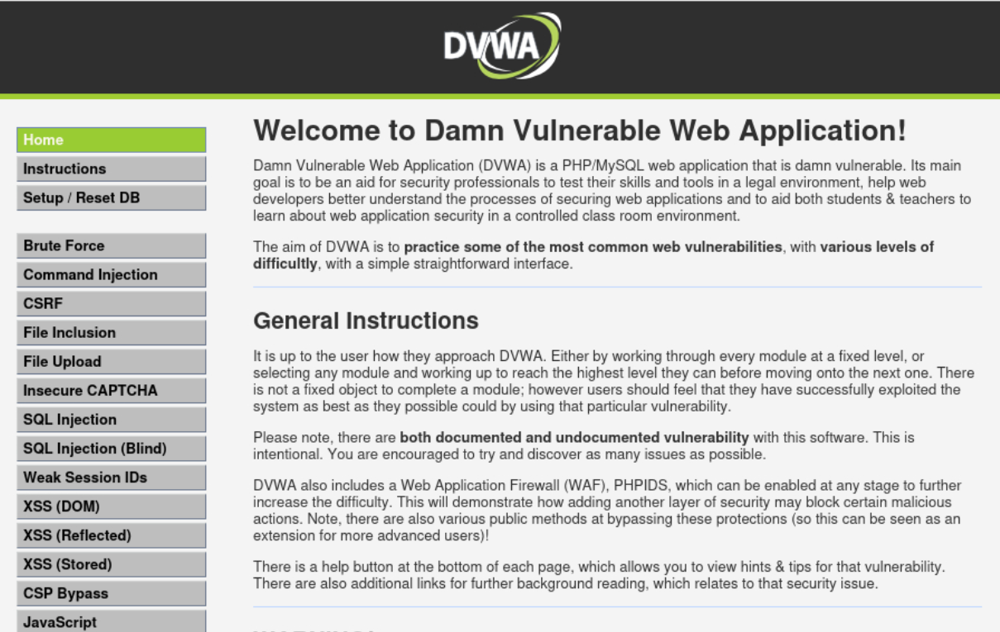

# Damn Vulnerable Web App (DVWA)

DVWA, o Damn Vulnerable Web App, es una aplicación web escrita en PHP y MySQL que está diseñada intencionalmente con fallos de seguridad. Sirve como herramienta educativa para que desarrolladores, estudiantes y profesionales de ciberseguridad practiquen pruebas de penetración, aprendan sobre vulnerabilidades comunes y prueben herramientas de escaneo en un entorno seguro. 

Estos retos son bastante interactivos, pudiendo incluso modificar la dificultad de los retos.

**Nota**
> Los retos estan en su mayoria resueltos en el nivel basico.

## Características principales de DVWA:

#### - Entorno de aprendizaje:

Permite entrenar habilidades de hacking ético sin riesgo, simulando ataques reales como inyecciones SQL, XSS, inclusión de archivos, entre otros.

#### - Niveles de seguridad:

Ofrece diferentes niveles de dificultad (Bajo, Medio, Alto, Imposible) para practicar métodos de prevención y mitigación, mostrando cómo corregir las vulnerabilidades.

#### - Fácil instalación:

Se puede instalar localmente o en servidores web (como WAMP/XAMPP) para realizar auditorías de seguridad y entender las vulnerabilidades del Top 10 de OWASP. 

## Retos:

[Brute Force](./challenges/brute_force.md)
[Command Injection](./challenges/command_injection.md)
[CSRF](./challenges/csrf.md)
[File Inclusion](./challenges/lfi.md)
[File Upload](./challenges/file_upload.md)
[SQL Injection](./challenges/sqli.md)
[SQL Injection Blind](./challenges/sqli_blind.md)
[XSS DOM](./challenges/xss_dom.md)
[XSS Reflected](./challenges/xss_reflected.md)
[XSS Stored](./challenges/xss_stored.md)
