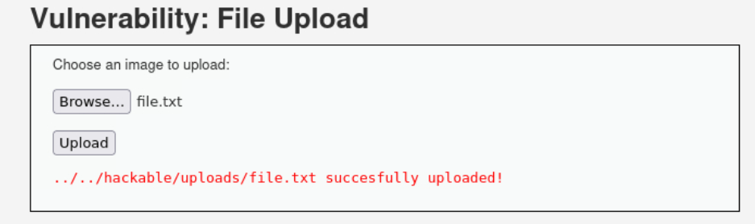

# File Upload

#### Que es un file upload?
Es un fallo de seguridad donde un atacante puede subir archivos maliciosos en lugar de archivos legítimos.

---

El reto presenta la opcion para subir archivos al servidor, al subir un archivo cualquiera se puede ver que los archivos se guardan en una ruta especifica.

Se puede acceder al archivo desde el navegador, solo accediendo a la ruta desde la url, logrando interactuar con el archivo que se subio.
