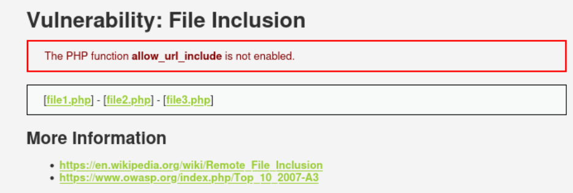
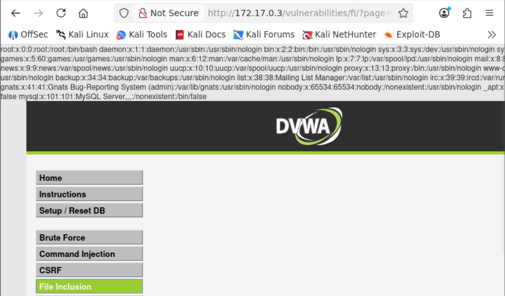

# File Inclusion / Local File Inclusion

#### Que es un File Inclusion?
LFI o Local File Inclusión es una vulnerabilidad que ocurre cuando se pueden leer archivos arbitrarios en el servidor que ejecuta la aplicación.

---

El reto muestra varios archivos, los cuales se pueden abrir e interactuar con ellos.
Lo interesante de estos es que al interactuar con ellos se puede ver como la url usa el parametro **page** para mostrar el archivo.

Viendo que la url muestra los archivos usando un parametro en la url se pudo modificar el parametro **page**, logrando acceder a archivos de el sistema, en este caso moviendonos entre directorios y logrando acceder a el archivo **passwd**.
