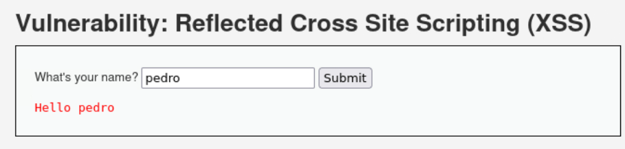
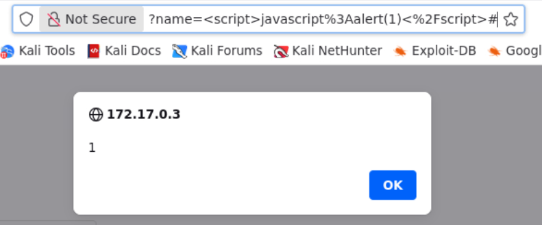

# Cross-Site Scripting (XSS) Reflected

#### Que es un XSS Reflected?
Un XSS Reflejado (Reflected Cross-Site Scripting) es una vulnerabilidad de seguridad web donde un atacante inyecta scripts maliciosos (generalmente JavaScript) a través de una URL maliciosa que la aplicación web refleja inmediatamente en la respuesta. El código se ejecuta en el navegador de la víctima al hacer clic, permitiendo robar cookies de sesión o secuestrar cuentas, ya que el navegador confía en el sitio web legítimo.

---


El reto presenta algo simple, un input que pide un nombre, y ya con este presenta en mensaje en la web.
Logrando observar que la web muestra contenido, lo cual es interesante para poder ejecutar codigo.


En el input se puede usar un script para (en este caso) mostrar un mensaje, usando el script para que el navegador interprete el codigo y lo ejecute.

```
<script>javascript alert(1)</script>
```
