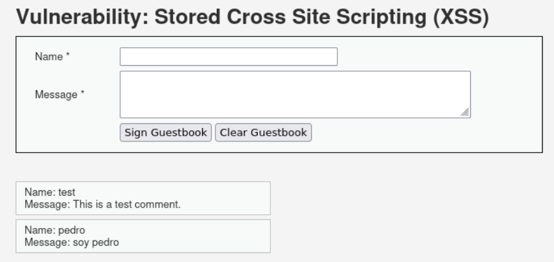
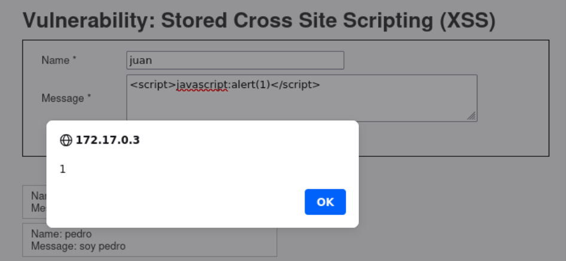

# Cross-Site Scripting (XSS) Stored

### Que es un XSS Stored?
Un XSS Stored (almacenado o persistente) en ciberseguridad es una vulnerabilidad crítica donde un atacante inyecta scripts maliciosos (generalmente JavaScript) que se guardan de forma permanente en la base de datos de una aplicación web. A diferencia del XSS reflejado, este código se ejecuta automáticamente en el navegador de cada usuario que visita la página comprometida (ej. foros, perfiles, comentarios), permitiendo el robo de sesiones, cookies o redirecciones.

---

El reto muestra un panel que permite crear una especie de "post" dentro de la web, dejando colocar el apartado de **nombre** y **mensaje** en la web.

Injectando un script dentro de la parte de el mensaje, logrando hacer que el script se guarde en la web y haciendo que al interactuar con esta pagina el script se ejecute.
