# OverTheWire – Leviathan Writeups

Wargame: Leviathan

---


---


# leviathan

  

Leviathan

\#Aviso#

\#Este writeup es creado para apoyar en la resolucion de los desafios de el leviathan.#

\#Recomiendo que se intenten resolver los desafios y solo si se necesita ayuda se consulte esta guia.#

Leviathan es uno de los wargames disponibles, diseñado para personas que ya tienen conocimientos básicos de Linux y quieren practicar escalación de privilegios, análisis de binarios simples y conceptos básicos de seguridad.

Enfoque:

Análisis de ejecutables.

Lectura de código binario simple.

Explotación de programas inseguros.

Uso de herramientas comunes de Linux.

¿Qué tipo de retos contiene?

Cada nivel de Leviathan incluye un archivo ejecutable ubicado en el home del usuario. Tu tarea es:

-   Analizar el binario (file, strings, ltrace, etc.).
-   Descubrir la vulnerabilidad (por ejemplo, ejecución de comandos, verificación de contraseñas mal implementada, permisos inseguros).
-   Usar esa vulnerabilidad para obtener la contraseña del siguiente usuario.


---

# level0

  

Nivel 0

El nivel 0 no cuenta con mucha informacion intencionalmente (al igual que los demas) como describe la pagina.

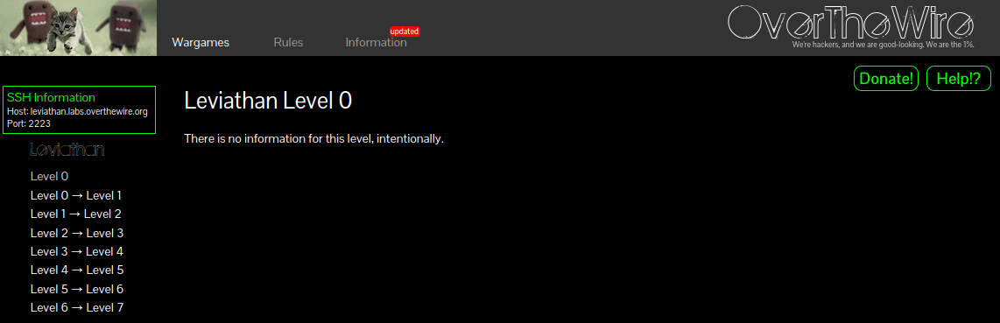

El inicio de este reto empieza con una coneccion por ssh, accediendo por la url con que la pagina proporciona, usando el usuario **leviathan0** y la clave **leviathan0**

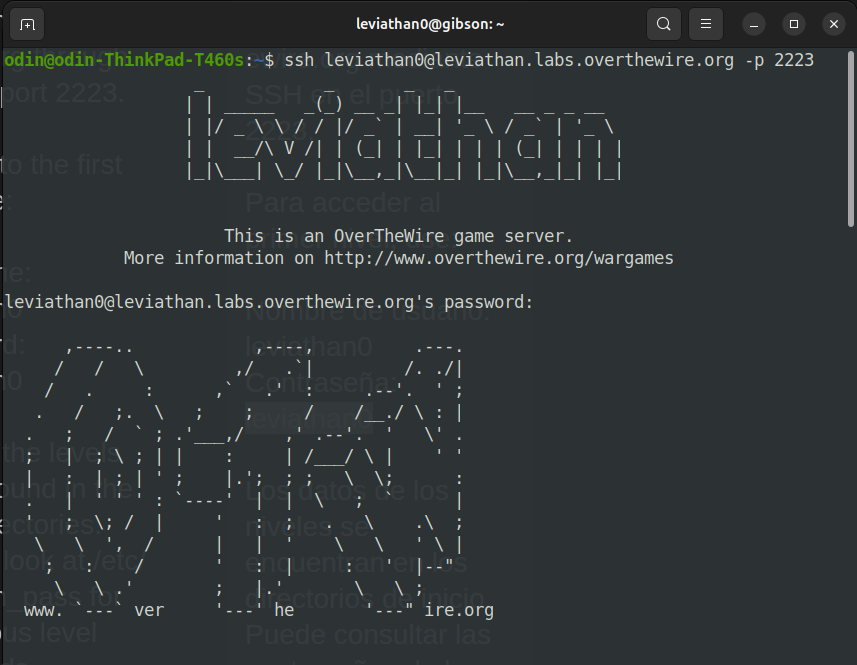

Dentro de la maquina se encontro la carpeta oculta .backup, la cual contenia el archivo bookmarks.html.

Se intento buscar algun servicio web instalado en la maquina para levantar un host y visualizar el archivo, pero al final solo se busco la palabra “password” en el archivo y aparecio la clave de el usuario leviathan1, el siguiente reto.

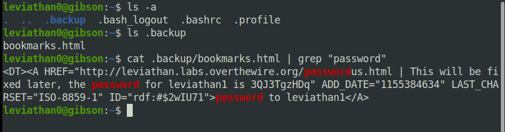

---

# level1

  

Level 1

Dentro de la maquina se puede ver un binario ejecutable con permisos de el usuario leviathan1.

El binario es un programa que solicita una clave para dar acceso a una terminal, o de esta ser incorrecta se cerrara el programa.

Usando ltrace se pudo ver que al correr el archivo este compara la clave con la palara “sex” en el output de ltrace.

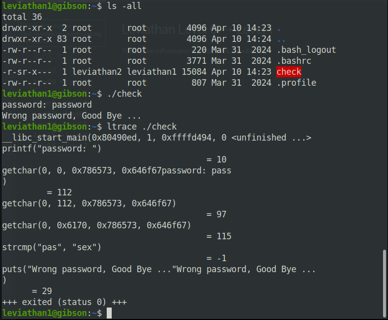

Usando la clave “sex” en el programa check se pudo acceder a la terminal, teniendo el permiso de abrir el archivo con la clave.

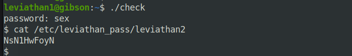

---

# level2

  

Level 2

listando los directorios se encontro un binario llamado printfile, al intentar ejecutar este solicita un archivo.

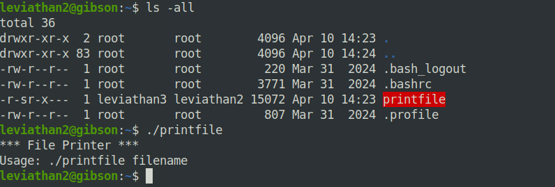

Lo primero fue crear este archivo, y luego se uso ltrace para ver como el programa interactua con el.

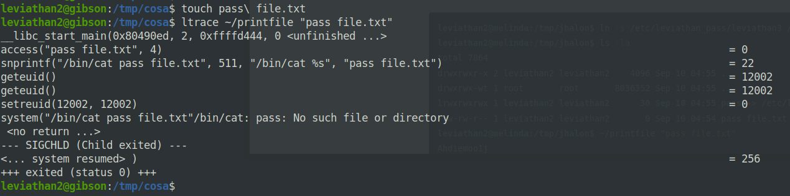

Ya viendo que hace el programa crearemos el archivo pass usando la informacion de el archivo leviathan3.

pudiendo con printfile visualizar la clave de la proxima maquina.

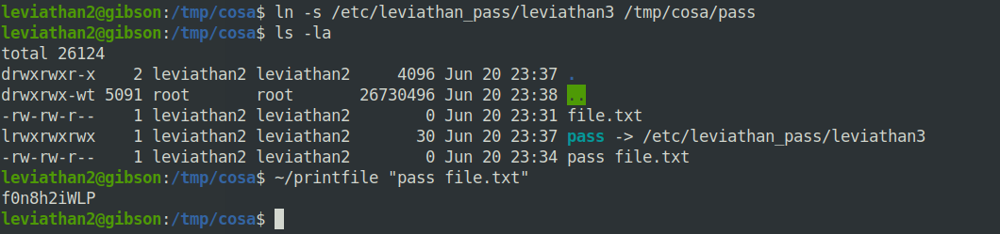

---

# level3

  

Level 3

Dentro de el tercer desafio se encontro un binario llamado level3, pidiendo este una clave secreta.

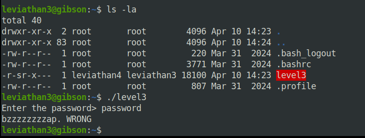

Usando ltrace para ver como funciona este programa se pude ver informacion util, usando la palabra snlprintf como clave.

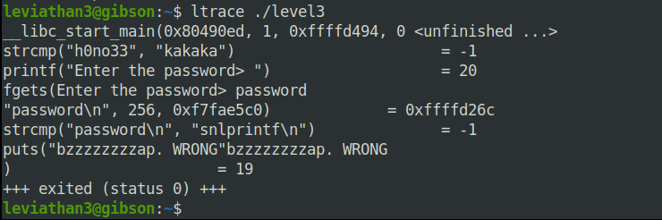

Gracias a ltrace se encontro una palabra la cual funciono como clave, pudiendo ver la clave de el siguiente reto.

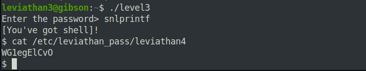

---

# level4

  

Level 4

Dentro de este desafio se pudo encontrar un binario llamado bin dentro de la carpeta .trash.

Al ejecutar este binario se proporciono un codigo binario.

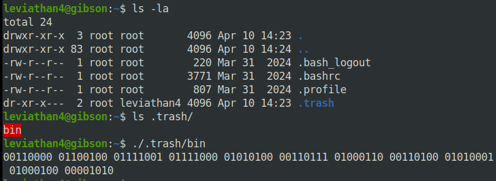

Desencriptando el codigo se obtuvieron dos resultados interesantes, convirtiendo el codigo binario en Decimal y luego en ASCII, siendo el formato ASCII el correcto para descubrir la clave del siguiente desafio.

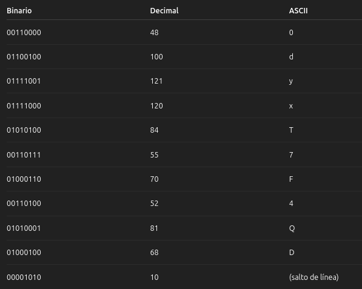

---

# level5

  

Level 5

Dentro de este desafio se encontro el binario leviathan5, el cualal ejecutarse solicita un archivo log.

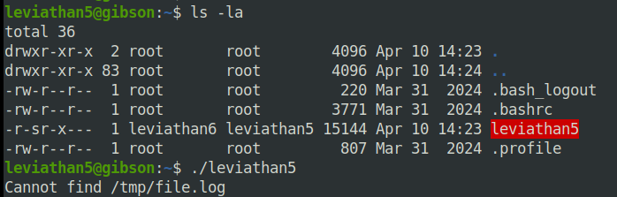

Viendo que este programa busca un archivo especifico, se creo un archivo con el mismo nombre.

Este archivo file.log se creo a partir de la informacion de el archivo leviathan6, el cual contiene la clave del siguiente desafio.

Ya con el archivo necesario creado se ejecuto el binario proporcionando la clave de el desafio numero 6.

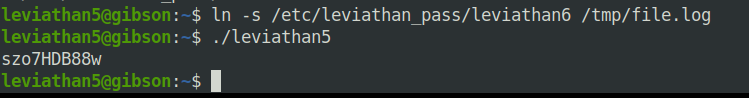

---

# level6

  

Level 6

Dentro de esta maquina se encontro el binario leviathan6, el cual para ejecutarse necesita un codigo de 4 digitos.

Para lograr ejecutar el binario sin el codigo se creo un archivo que ejecutara un ataque de Duerza bruta, dandole permisos a este.

```

    nano /tmp/BF.sh
    chmod +x /tmp/BF.sh

```

El archivo consiste en un script que usara varias combinaciones de codigos numericos de 4 numeros, usando estos codigos en el archivo leviathan6 hasta que este se ejcute correctamente.

```
    #!/bin/bash

    for a in {0000..9999}
    do
    ~/leviathan6 $a
    done

```

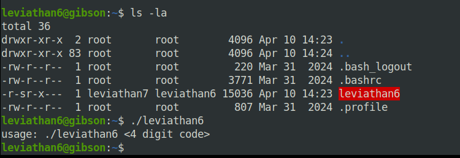

Luego de ejecutar el archivo de fuerza bruta este empieza a probar los codigos, luego de varios intentos el programa cedio, ya pudiendo ver la siguiente clave necesaria.


---

# level7

  

Level 7

El Desafio 7 solo contiene un archivo de texto.

Este es un agradecimiento por completar los desafios, pidiendo el favor de no publicar informacion de estos para no arruinar la experiencia de los jugadores.

\#Volviendo a recalcar que este registro es solo para ayuda, recomiendo que se empieze a explorar los desafios, y solo al quedarse atorados soliciten la informacion#

\#Dicho esto espero no solo hayas copiado y pegado comandos....👀pequeño script kiddie.#

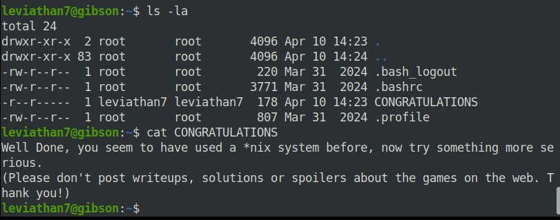
