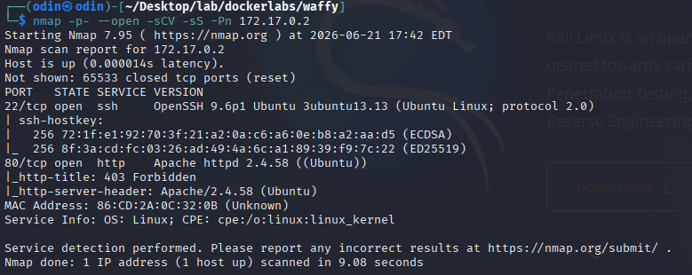
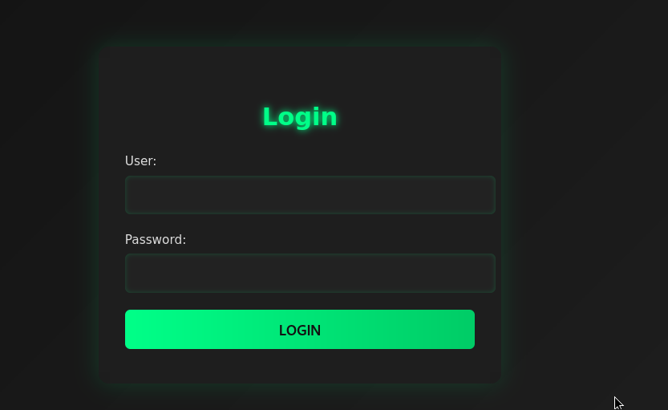
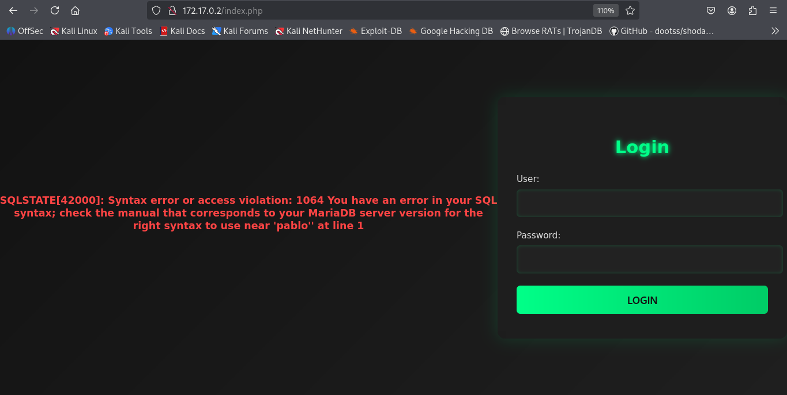
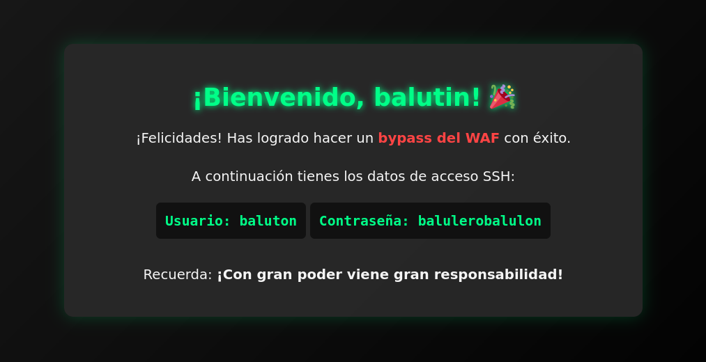
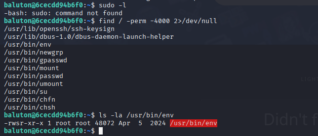
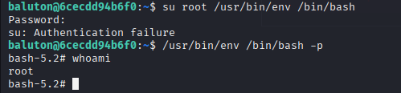
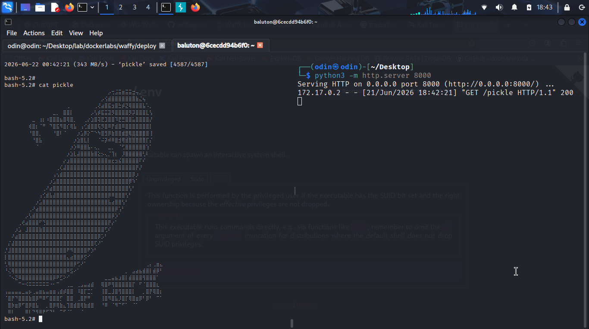

# Maquina: Waffy
- Dificultad: Dificil
- OS: Linux


---

## Reconocimiento.

La fase de reconocimiento inicio con un escaneo de nmap.
Descubriendo el puerto 22 y el 80 abiertos.



Viendo que el puerto 80 alberga una web con un panel de login.



Lo basico que se intento fue una injeccion sql, viendo un mensaje que aparece un mensaje de error que da informacion de que la base de datos utilizada es MariaDB.



Invstigando sobre algunas payloads (y fallando muchas veces) se encontro una alternativa de injeccion justo para MariaDB.
Usnado esta web como referencia se pude ver un parametro que sera util para hacer el bypass al login, [https://mariadb.com/docs/server/reference/sql-functions/special-functions/json-functions/json_valid](https://mariadb.com/docs/server/reference/sql-functions/special-functions/json-functions/json_valid)

``` sql
'OR JSON_VALID(id)- --

```



Despues de el bypass la web proporciona las credenciales de un usurio, y recordando que hay un servicio ssh se accedio dese ahi.
Se intento usar sudo pero este no estaba disponible, asi que se buscaron binarios con ciertos permisos usando find, encontrando el binario **/usr/bin/env**.



Desde [GTFBins](https://gtfobins.org/gtfobins/env/) se pudo ver un comando muy util para usar los permisos **SUID** en esta terminal.



---

## Pickle !!!


