# Maquina: Kmspwned
- Dificultad: Facil
- OS: Linux

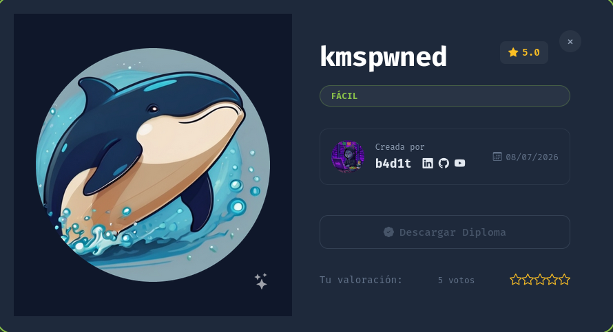

---

## Reconocimiento.

La fase de reconocimiento inicia usando **nmap** para realizar un escaneo de puertos y servicios.
Encontrando que el puerto 22 y el puerto 80 estan abiertos.

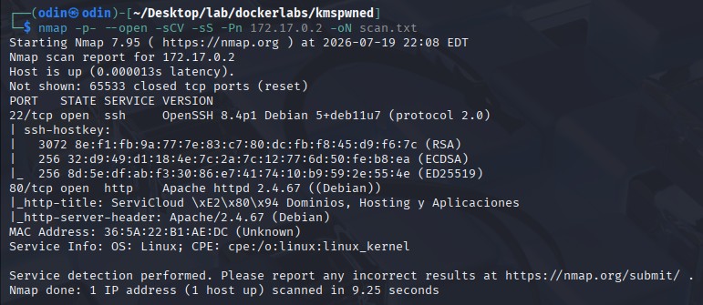

Accediendo desde el navegador se puede ver una web simple, esta haciendo alucion a servicio de **dominios y aplicaciones en la nube.**

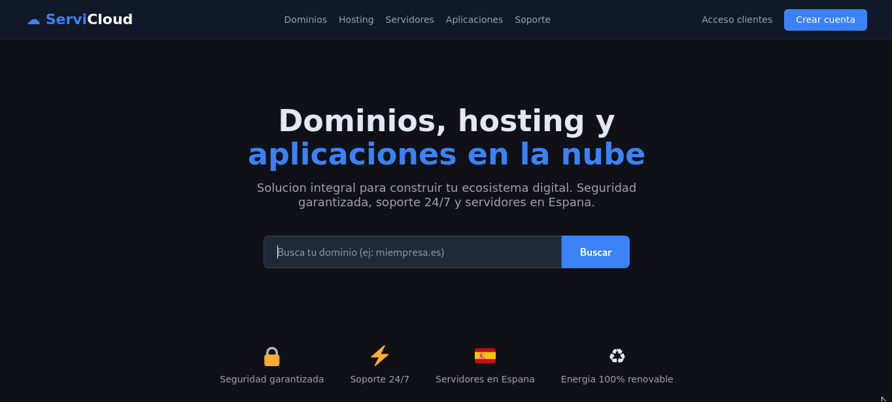

Explorando un poco la pagina se puede ver que esta permite crear un usuario.
Creando nosotros al usuario fulano para futuras pruebas.

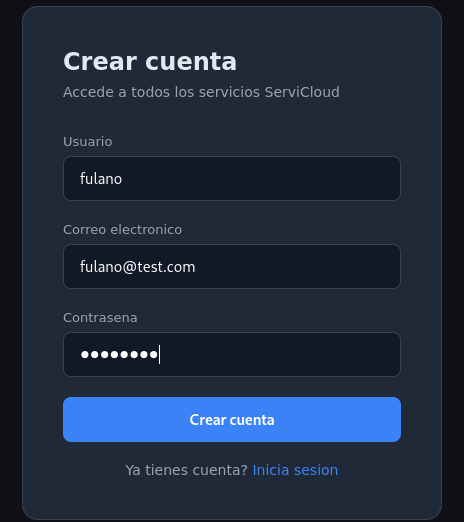

Ya logeados y explorando un poco la pagina se probaron varios ejemplos comunes (y de paso una inyeccion sql *cof cof)

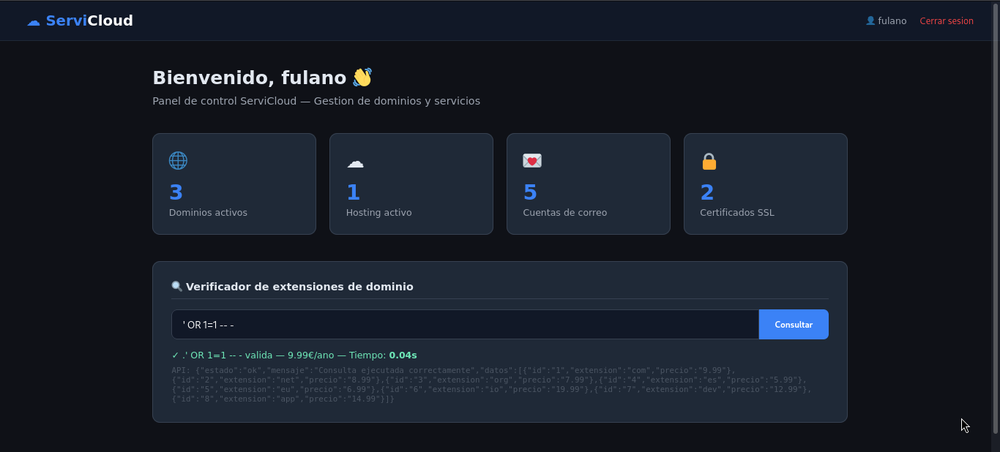

Viendo que la inyeccion da frutos, se capturo la peticion desde burpsuite y se guardo en un archivo.

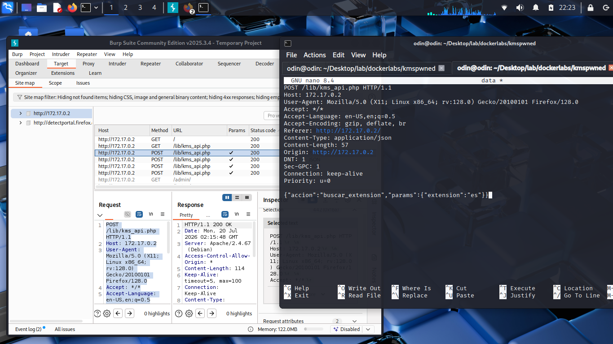

Logrando usar la herramienta **sqlmap** con esta peticion, logrando acceder a la base de datos y encontrando dos flags (algo irrelevante para los retos de dockerlabs, pero se agradece el detalle)

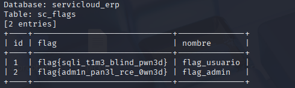

Y logrando encontrar credenciales de otros usuarios ya existentes dentro de el servidor.

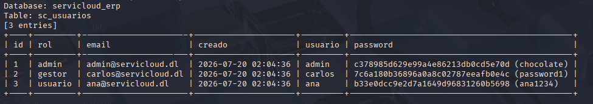

``` bash
sqlmap -r peti.txt --batch --dump
```

> NOTA

> Tambien pudimos ver nuestra propia informacion

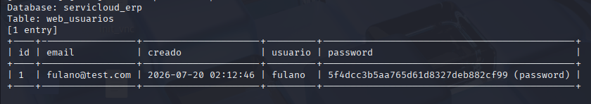


Y por ultimo encontrando una pista que nos guia hacia el panel de administracion (aunque era un poco obvio).

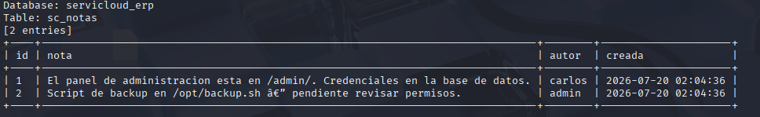

Ya dentro de el panel (con las credenciales de el usuario admin) se pudo ver el dashboard de este.

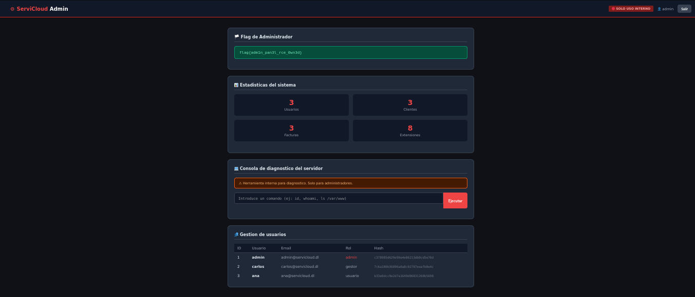

Aprovechando las nuevas credenciales obtenidas se accedio a la maquina por ssh siendo el usuario carlos.

---

## Escalada de privilegios

### Carlos > Root

Dentro de la maquina vemos una flag, y aparte de esto recordamos una de las dos pistas que vimos en la base de datos, el comentario que hacia alucion a la ruta **/opt**.
Entrando a esta ruta se pudo ver un archivo llamado **backup.sh**, el cual pertenece al usuario root.

Este archivo crea una copia de seguridad diraria, y crea unos logs registrando la hora.

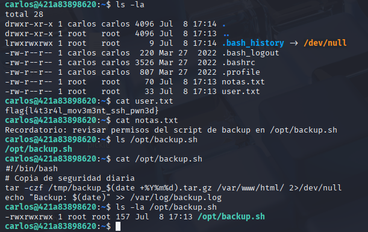

Ya que ...raramente tenemos permisos de escritura agregamos una linea al archivo que nos permitira una reverse shell.
Quedando solo a la escucha en el puerto seleccionado y esperando a que el script se ejecute para la proxima copia de seguridad.

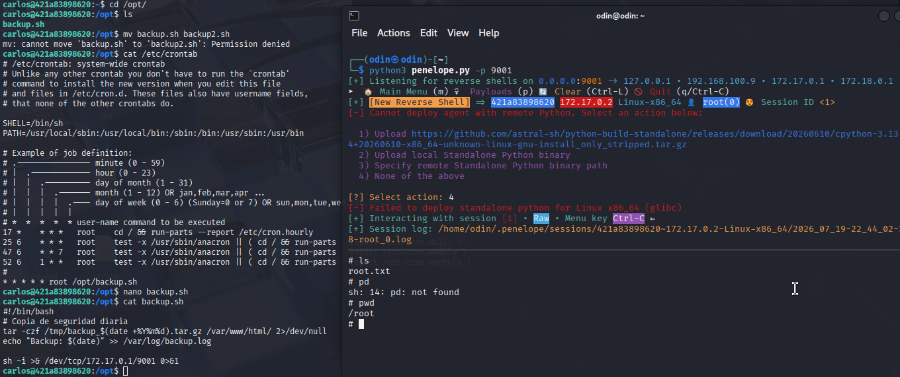

Consiguiendo asi el control sobre el usuario root.

---

## Pickle Rick!

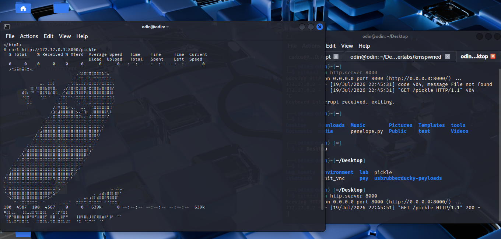
