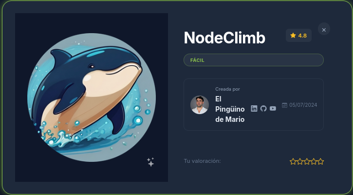
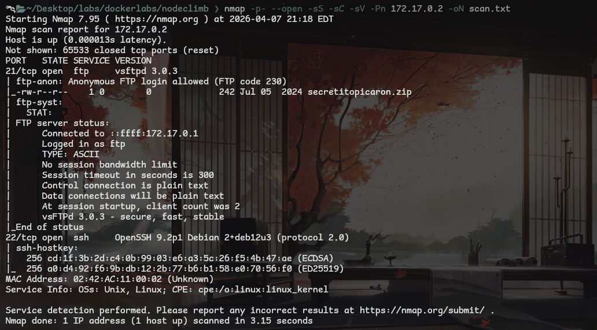
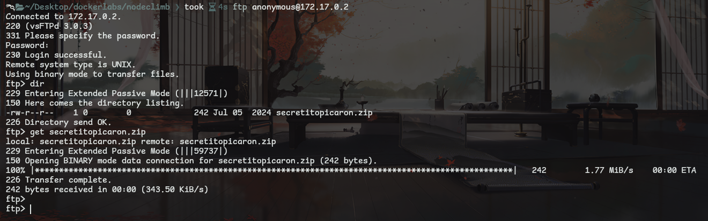
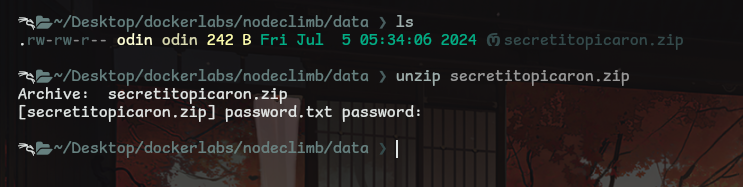
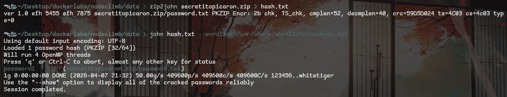
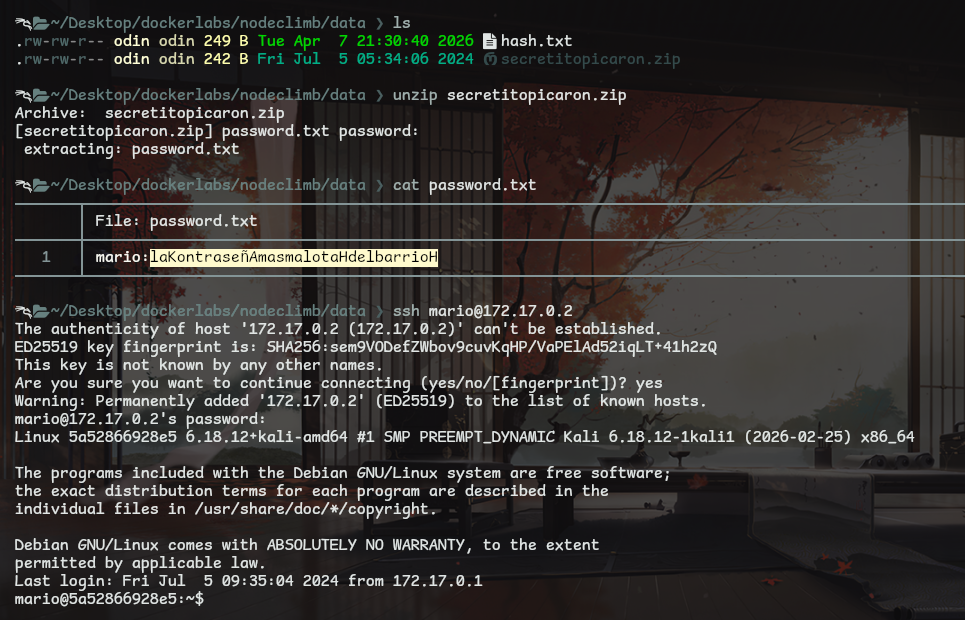
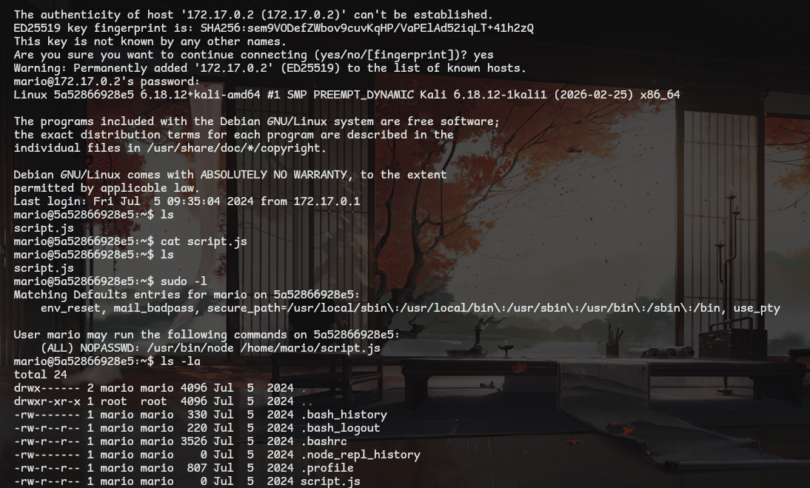
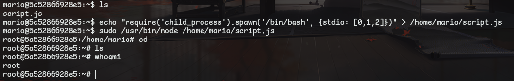

# Maquina: Nodeclimb
- Dificultad: Facil
- OS: Linux

---

## Reconocimiento

La fase de reconocimiento empieza con un escaneo de nmap.
Encontrando un servicio ftp y un servicio ssh.

Resulta que el servicio ftp tiene activo al usuario **anonymous**, el cual permite acceder (normalmente) sin clave al servicio ftp.
Logrando ver un archivo llamado **secretitopicaron.zip** el cual se pudo descargar.

Resulta que el archivo requiere clave (lo cual no es sorpresa), asi que habra que crackear la clave de el archivo.

Para crackear la clave hubo que pasar el hash de el archivo a un archivo en texto.
Para generar este hash se uso la herramienta **zip2john**, ya que el archivo a crackear es un **ZIP**.

Ya habiendo creado el hash se uso **john the ripper** con el diccionario rockyou para crackear la clave.

Ya teniendo la clave solo queda acceder al archivo, logrando ver informacion interesante.
La informacion muestra un usuario y clave, y sabiendo que hay un puerto ssh abierto se intento acceder por ahi.

---

## Explotacion

Ya habiendo accedido a la maquina se procedio con la escalada de privilegios.

Dentro de el directorio de el usuario mario se encuentra un archivo llamado **script.js**, aunque este esta vacio, aunque se puede ver que hay permisos de escritura.
Investigando un poco con sudo se puede ver que el usuario **root** tiene accedo directo al archivo **script.js** y al binario **/usr/bin/node**.

La intencion es hacer que este archivo nos de acceso a una terminal de root.
Ya que hay permisos de escritura se agrego un script al archivo, uno que crea un proceso con la terminal **/bin/bash**.
Al ejecutarlo se puede facilmente acceder a una terminal, siendo el usuario root

---
