# Maquina: Talent
- Dificultad: Medio
- OS: Linux

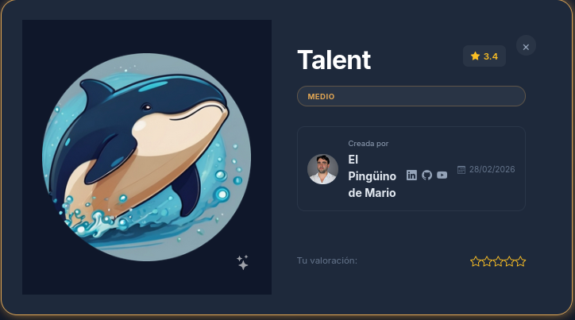

## Reconocimiento.

La fase de reconocimiento inicia con un escaneo de nmap, descubriendo el puerto 80, el cual esta expuesto por un servicio web, un wordpress activo.
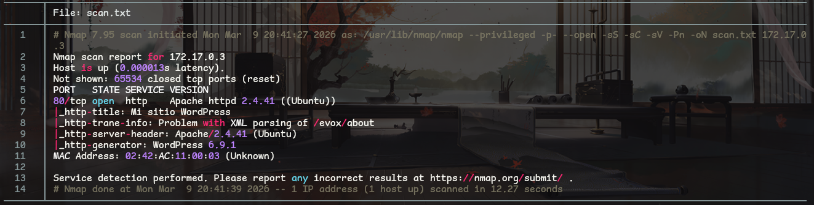

Usando la herramienta wpscan se inicio un escaneo al servicio de wordpress, realizando varios escaneos con especificaciones.

En este escaneo se logro ver una vulnerabilidad en el pie register, dentro de los plugins.
``` bash
wpscan --url http://172.17.0.3:80 -o wp_info_u.txt --enumerate p
```
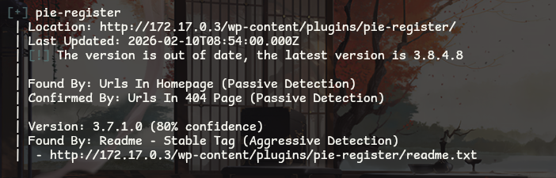

En  este escaneo se descubrio al usuario admin en una deteccion pasiva.
``` bash
wpscan --url http://172.17.0.3:80 -o wp_info_u.txt --enumerate u
```
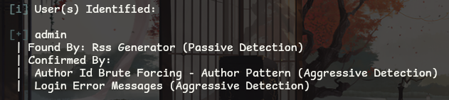

Usando la herramienta searchsploit se intento buscar un exploit util, en el primer escaneo con **wpscan** se pudo ver que el pie register es vulnerable.
Usando esta informacion (y la version de este) se logro encontrar un script util.


El exploit crea varias cookies.
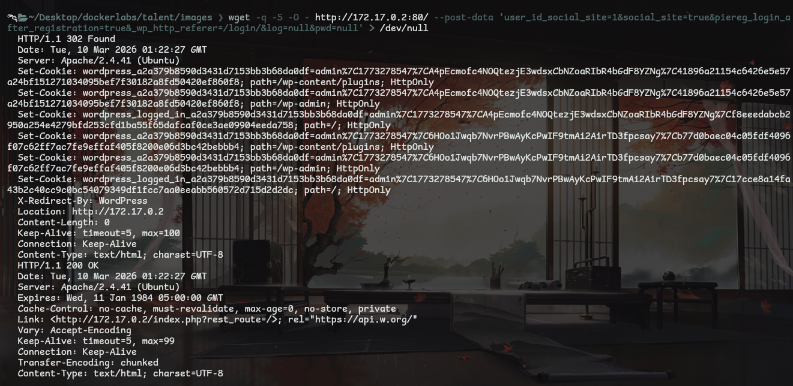

Usando las herramientas de desarrollador de el navegador hay que crear una cookie, usando la informacion de el exploit.
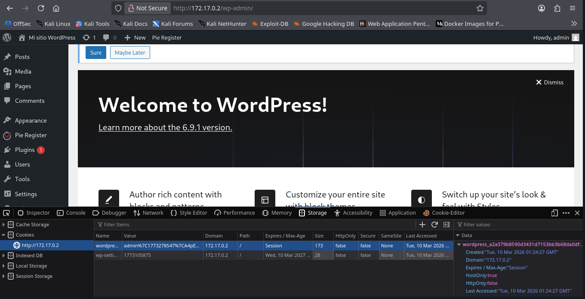

ya dentro de la web (con el usuario root) hay que manipular una de las plantillas.
Editando uno de los temas ( Tools > Theme file editor ) hay que crear una reverse shell, editando el **functions.php** con el reverse shell de [pentest monkey](https://github.com/pentestmonkey/php-reverse-shell) y modificando la ip y el puerto, se logra obtener una shell en el servidor.

```
# modo escucha usando netcat
nc -lvp 443

# modo escucha usando penelope (herramienta que hace mas facil el tratamiento de la tty y otros)
penelope -p 443
```

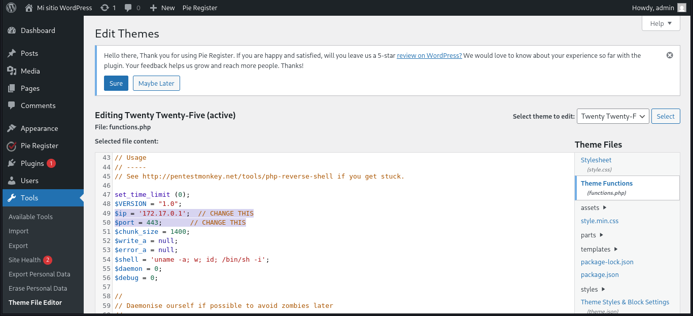

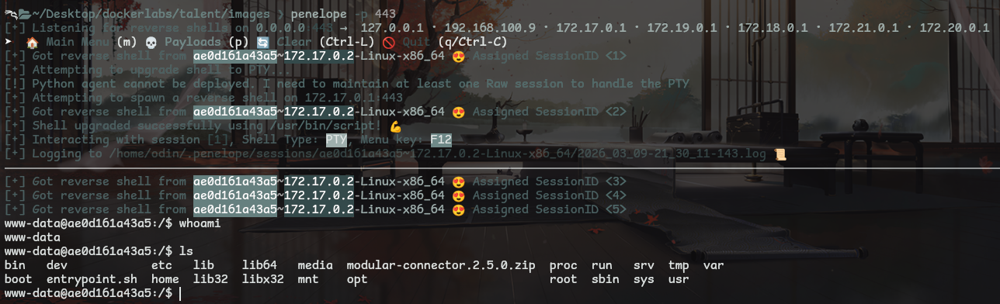

## Explotacion.

Siendo el usuario **www-data** dentro de la maquina se lograron ver cosas interesantes.
Como una especie de flag (aunque estos retos no lo requieren) y un usuario que tiene permisos sobre python.
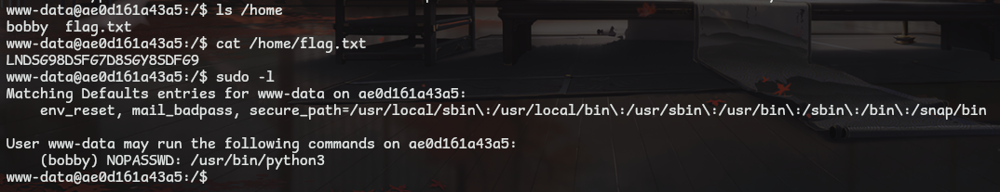

---

> Nota

La maquina que obtuve al parecer no trae python instalado, asi que hay que acceder al contenedor y instalar python3 para proseguir con la vulnerabilidad.
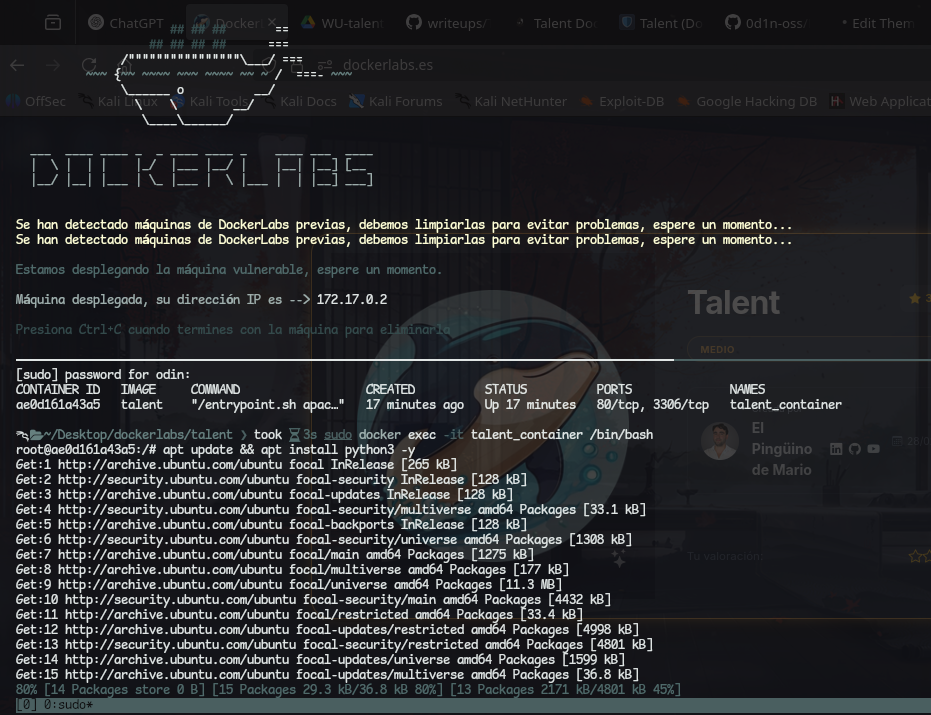

---

Usando la pagina [gtfobins]() se logro explotar la vulnerabilidad, escalando los privilegios hacia al usuario bobby.
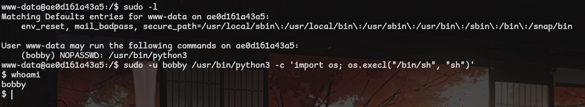

Dentro de el usuario bobby se puede ver algo interesante, usando sudo se logro ver que el usuario root tiene permisos compartidos con python y con un archivo llamado **backup.py** dentro de opt.
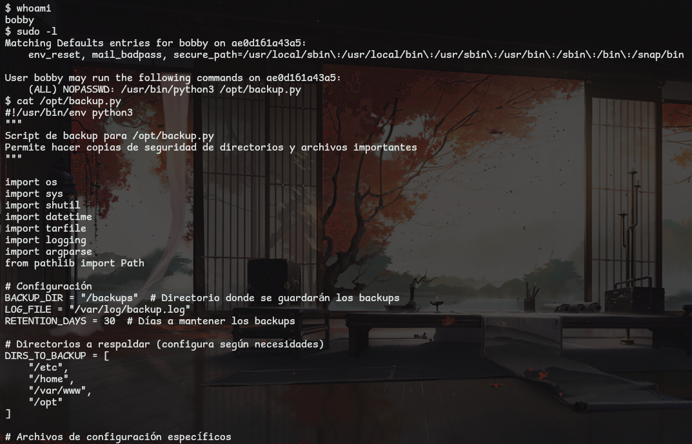

Para la escalada de privilegios hay que analizar el archivo **backup.py**.
ya que hay permisos de escritura se pudo cambiar el nombre a backup2.py y crear nuestro propio archivo backup.py (y darle permisos de ejecucion), el cual permite ejecutar una terminal de bash usando os.system en python.

Ejecutando el archivo como se describe al usar " sudo -l " se logra acceder a la shell de el usuario root, obteniendo control total sobre la maquina.
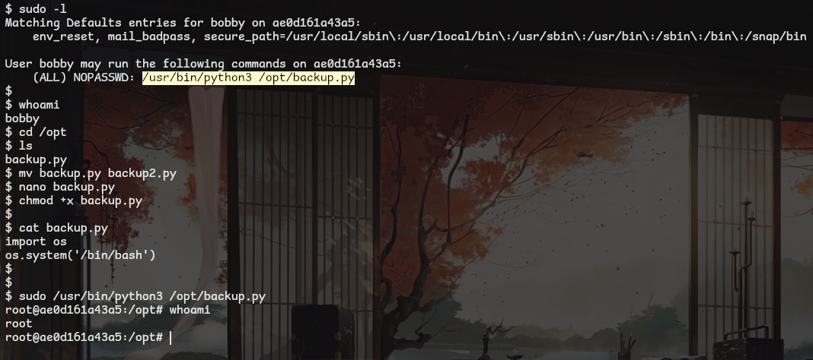

## Conclucion

La maquina fue entretenida, nada tan innovador y respeta bien su nivel de dificultad.
Aunque el detalle de tener que "reparar" el contenedor fue algo raro.

# Pickle !!
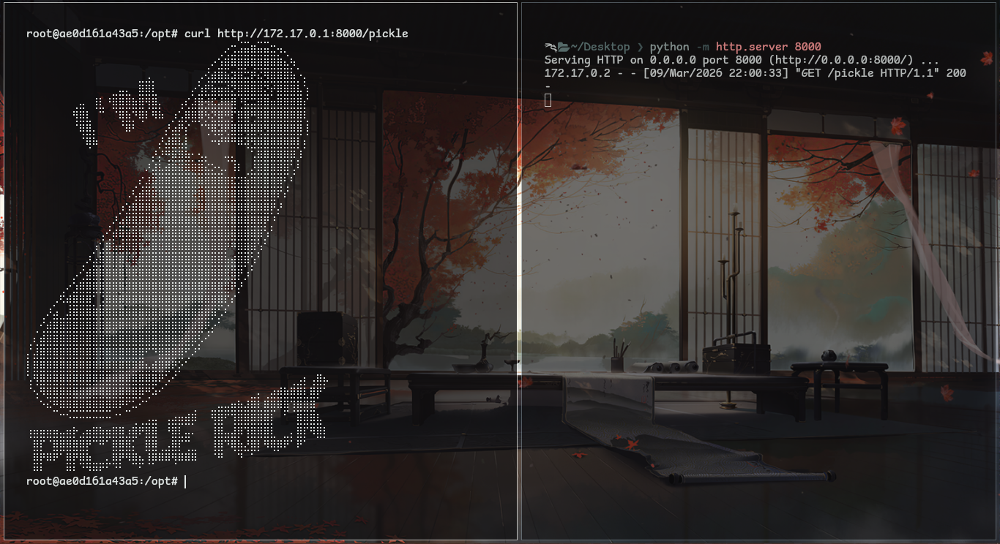
