# Maquina: Woekconnect
- Dificultad: Medio
- OS: Linux

---

## Reconocimiento.

La fase de reconocimiento empezo con un escaneo de nmap.
Reconociendo el puerto 8000, el cual alberga una web.

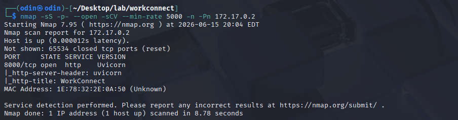

Dentro de la url se puede ver una web que aparenta ser de una empresa.

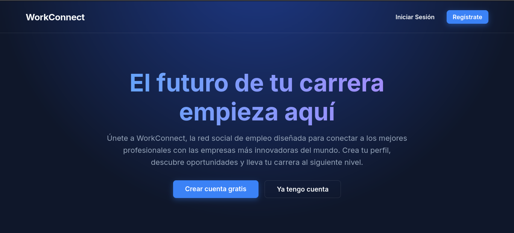

Usando gobuster se lograron ver varias rutas, la que interesa actualmente es **docs**.
Este es un dashboard de **fastapi**, el cual contiene los tipos de peticiones que se hacen a la api.

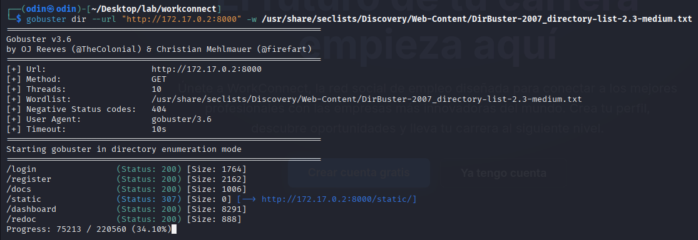

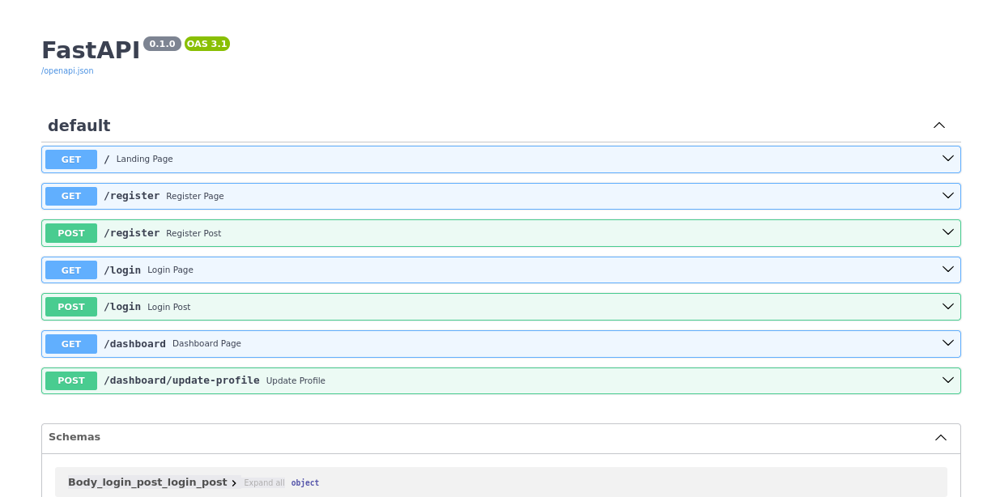

Explorando rapidamente la pagina **/login** se puede ver que esta solicita un  dni y un password.

usando curl se hizo una peticion hacia la ruta **/register**, filtrando por palabras clave.

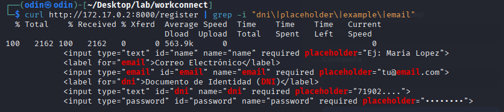

Ya con estos datos se creo una peticion de prueba hacia el **/register**, con el fin de ver como reacciona la web.
Usando el ejemplo de dni que se nos dio.

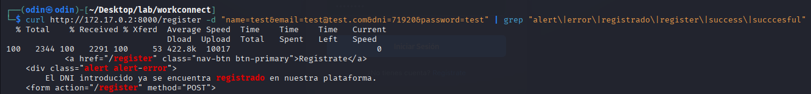

> NOTA
> resulta que el ejemplo de dni dice 71902.... asi que hay que tomar en cuenta los 4 puntos como caracteres.

Haciendo algunas peticiones se pueden ver dos tipos de mensajes de error, uno en donde hay un **alert-error**, un codigo que normalmente indica que ya hay un usuario registrado y no se pueden sobreescribir los datos.
Y el **alert-success** que indica que ese usuario se acaba de registrar con exito.

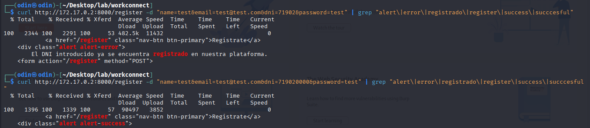

Ya con nuestro usuario registrado se pueden usar estas credenciales desde el panel de **/login**, accediedo a otro dashboard.

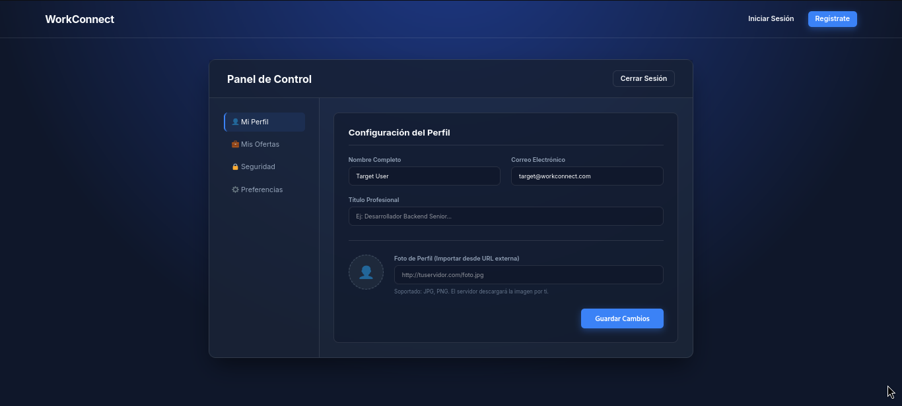

Desde este nuevo panel se intento inyectar codugo en los distintos inputs.
Usando el **; whoami** se pudo ver info de la terminal en la web, pudiendo comprobar una ejecucion de comandos.

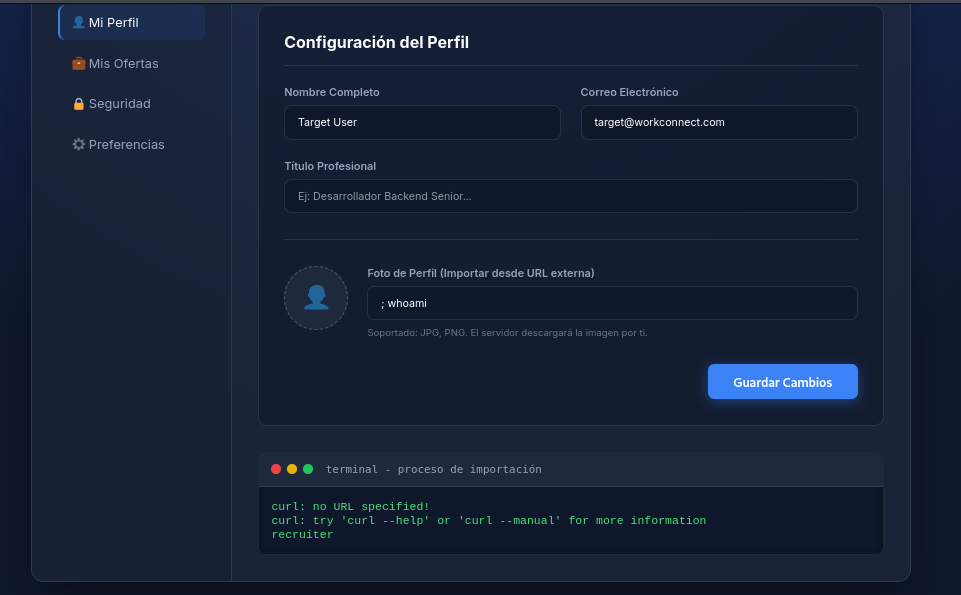

Usando una reverse shell en bash y escuchando por netcat desde nuestra maquina, accediendo a esta maquina con exito.

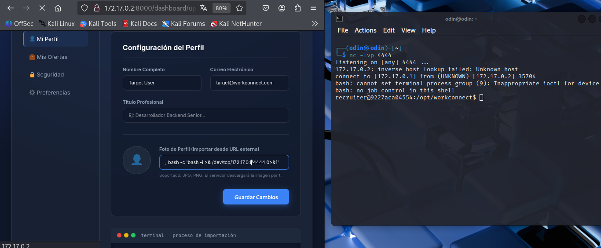

---

## Explotacion

Explorando esta maquina se pudieron ver cosas interesantes.
Siendo el usuario recruiter se pudo observar que en la ruta **/opt** se encuentran varios archivos.
Listando estos se puede ver que hay un archivo ejecutable llamado **/opt/backup.py**, el cual cada 60 segundos se ejecuta.

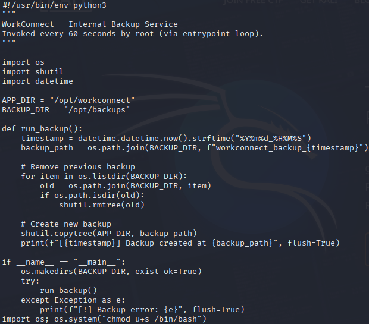

Inyectando codigo en este archivo se logra acceder a una terminal de root.
Procediendo a inyectar codigo malicioso se puede dar permiso al archivo /bin/bash para acceder, y, despues de 60 segundos el programa se ejecutara, en conjunto con nuestro codigo.

Pudiendo acceder a una terminal siendo root.

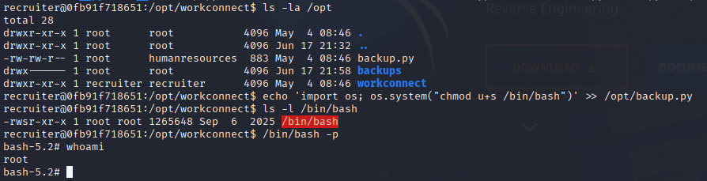

---

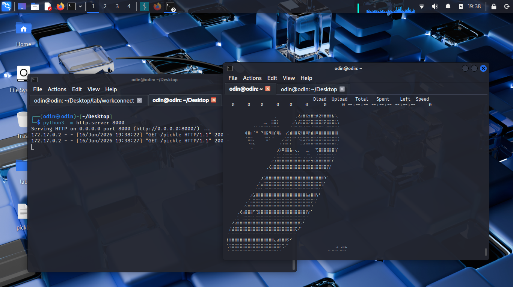
