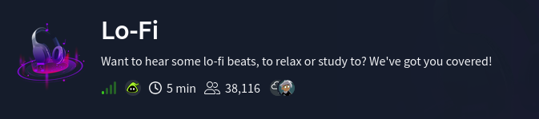
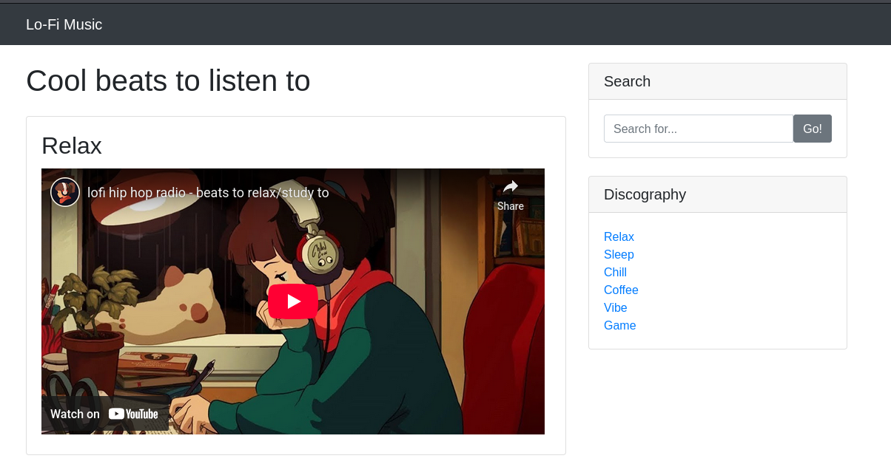
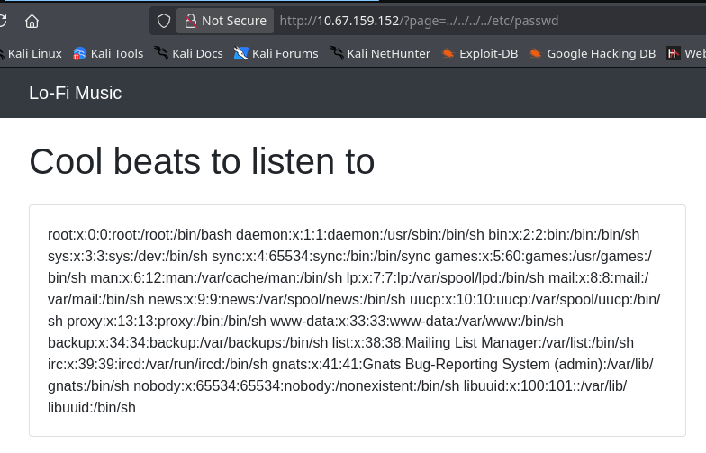
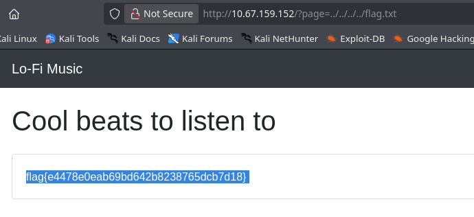

# Reto: Lo-Fi
- Dificultad: Facil
- Tipo: Desafio
- Tecnologia: 

---

El desafio muestra una pagina web, esta contiene videos de tipo **lo-fi** (musica, relajacion, etc...)

Observando la pagina se pueden ver unos links, cada uno muestra un video.
Observando la url esta parece ser suceptible a un **LFI** en la web, logrando comprobarlo leyendo el archivo **passwd**.

Ya viendo esta vulnerabilidad hay que buscar una flag, el usuario predeterminado para los servicios webs es **www-data**, y su directorio es **/var/www**.
Con esta informacion asumimos que el archivo que necesitamos se llamara flag.txt (por suerte fue asi), logrando abrirlo desde la url.

