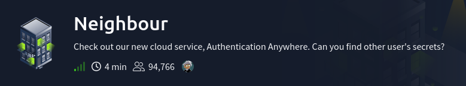
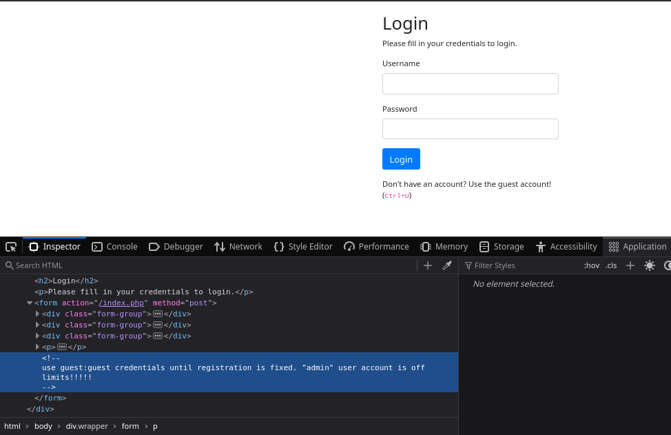
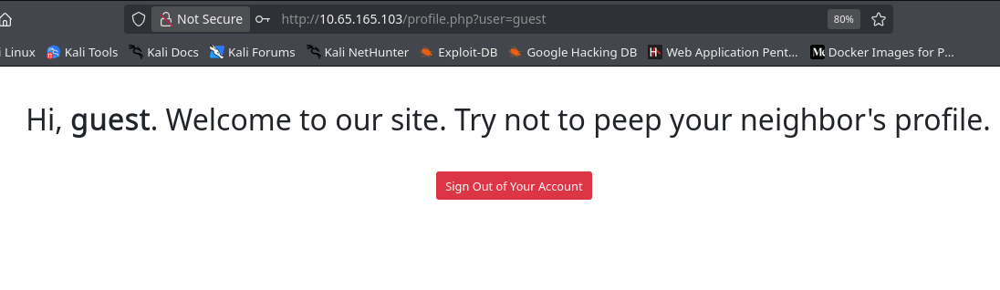
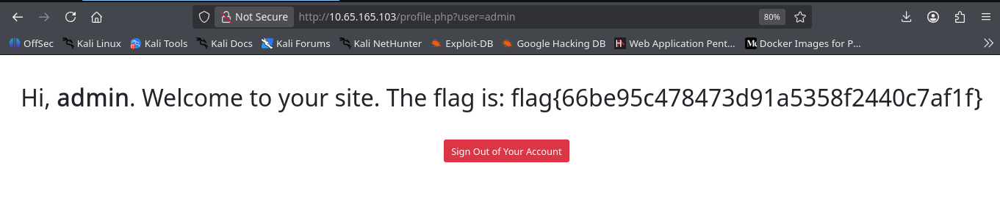

# Reto: Neighbour
- Dificultad: Facil
- Tipo: Desafio
- Tecnologia: Navegador web

---

El reto presenta una pagina web al iniciarlo.
Una web con un panel de login algo simple, y con una pista al final (Ctrl+U), indicando revisar el codigo.
Dentro de el codigo de la web se pueden ver credenciales claras **guest:guest** para acceder.

Logrando conseguir el acceso a la pagina se puede ver algo interesante.
La web solo tiene un mensaje simple, pero la url muestra un parametro con el usuario actual.

Solo cambiando el usuario **user=guest** a **user=admin** en la url se pudo conseguir el acceso, y con este la flag.

