# Maquina: SoupeDecode 01
- Dificultad: Facil
- OS: Windows
- Tipo: CTF

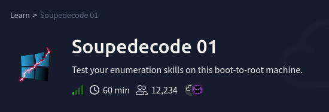

---

## Reconocimiento.

La fase de reconocimiento inicia con un escaneo de nmap, descubriendo varios puertos activos con servicios detras.

En este caso el puerto 3389 muestra informacion interesante, en este caso los dominios.

> Nota

> los dominios que se mostraron en el escaneo se deben agregar al archivo /etc/hosts.

> Ejemplo: IP   DC01.SOUPEDECODE.LOCAL SOUPEDECODE.LOCAL

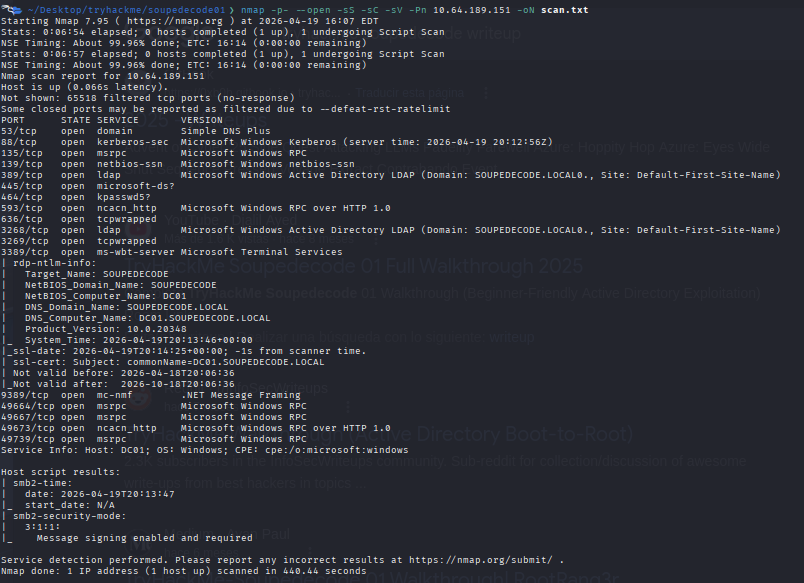

Usando nxc se intento hacer una coneccion por smb usando el usuario guest.

Este usuario esta creado comunmente para un acceso rapido al servidor.

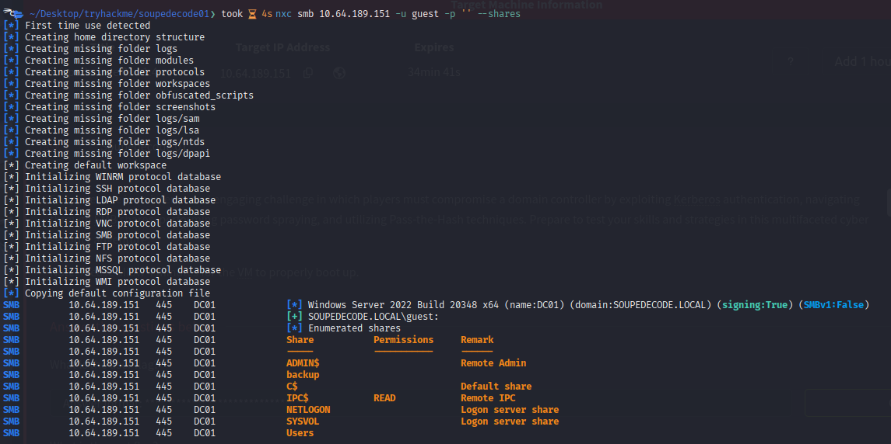

Usando la extencion "--rid-brute" se logra probar muchos RID (Relative Identifiers) para descubrir usuarios y grupos válidos en el dominio.

> Nota

> Para crear la lista el util limpiar los datos, creando una nueva lista con los usuarios.

> shell:// " grep "SidTypeUser" output.txt | cut -d'\' -f2 | cut -d' ' -f1 | grep -v '\$' > usernames.txt "

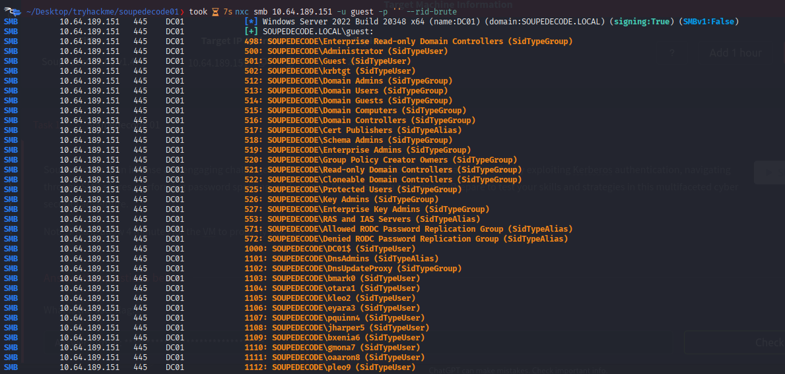

Es comun que algunos usuarios usen sus nombres o los nombres de otros como clave.

Creando una lista con los datos obtenidos se logran probar muchas combinaciones, buscando el usuario correcto.

En este caso evitaremos usar fuerza bruta, ya que el servidor podria bloquear ciertos intentos.

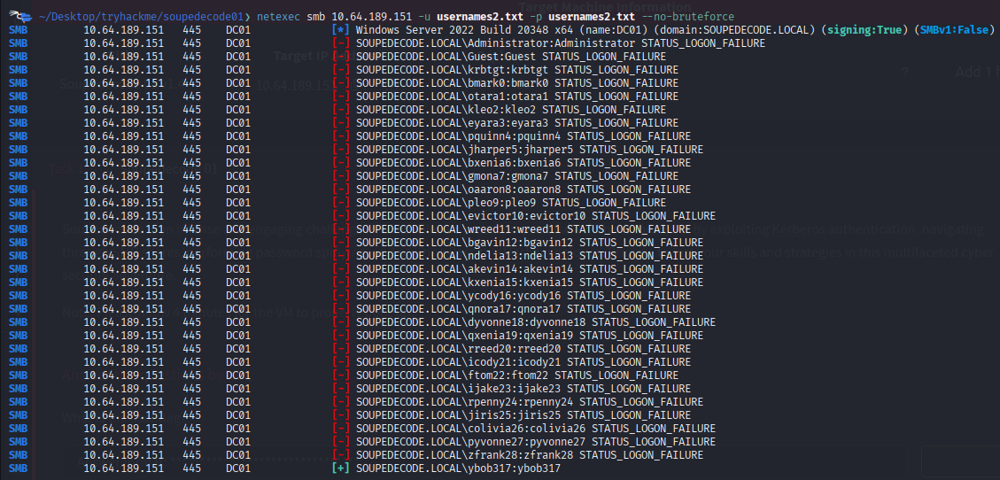

Ya con el usuario obtenido se puede acceder por smb, viendo los directorios disponibles.

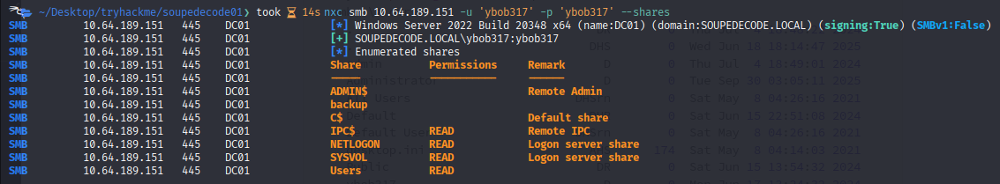

## Explotacion

Desde smb se pueden ver varios directorios, en donde resalta el directorio con el nombre de el usuario.

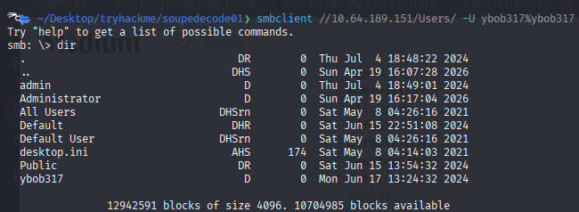

Este directorio cuenta con otro dentro, llamado "Desktop", el cual contiene un archivo llamdo **user.txt**.

El cual contiene la primera flag de el reto.

> Flag 1:
> 28189316c25dd3c0ad56d44d000d62a8

---

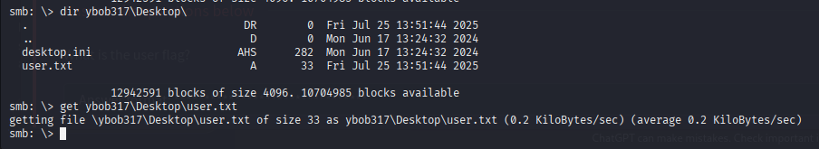

Siguiendo con la explotacion se intento hacer **Kerberoasting**.

Kerberoasting es pedir “tickets Kerberos” de servicios y luego intentar romperlos offline para obtener contraseñas.

Usando el comando **ImpacketGetUserSPNs** se solicitaron tickets kerberos, almacenando la informacion en un archivo.

Usando **john the ripper** se logro crackear la informacion, obteniendo la clave que necesitabamos.

Ya teniendo varios usuarios (al momento de solicitar los tickets) se pudo accedcer por smb con el usuario **file_svc** y la clave **Password123!!**.

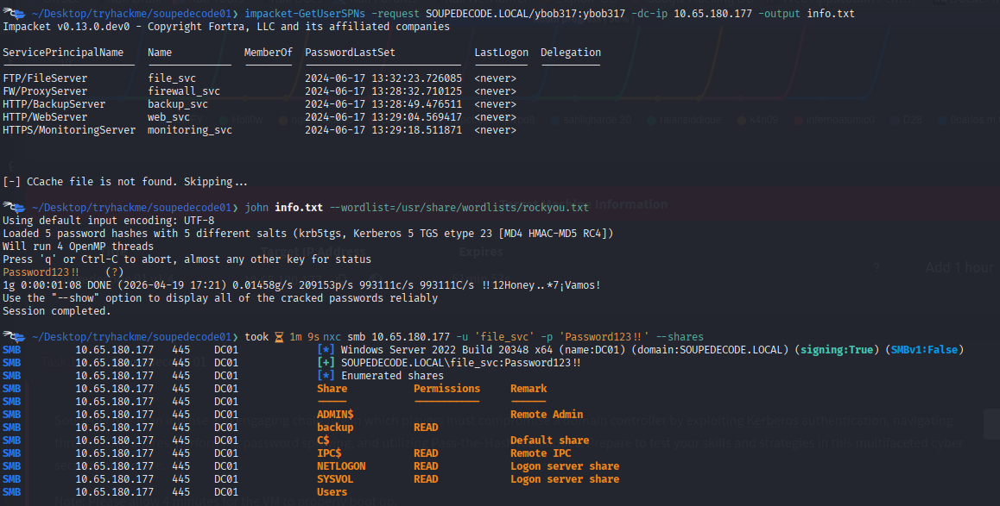

Listando los directorios de este usuario se pudo ver el directorio **backup** el cual llama mas la atencion.

Dentro de este se encuentra un archivo llamado **backup_extract.txt**, procediendo a descargarlo, encontrando usuarios y hashes.

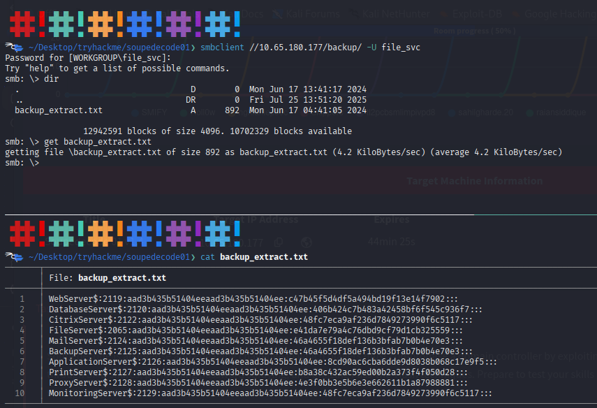

Con estos hashes se usaron varias combinaciones, ya teniendo una lista de usuarios y una lista de hashes.

> Nota
> Para crear las listas se tomo el archivo con toda la informacion, filtrando la info y creando las listas.

``` bash
# Lista para usuarios
awk -F':' '{print $1}' hashes.txt | tr -d '$' > users_hashes.txt

# Lista para hashes
cut -d':' -f4 hashes.txt > clean_hashes.txt
```

Dentro de todas estas combinaciones se logro descubrir una combinacion acertada.
Un usuario y hash que lograran dar un acceso.


Logrando acceder con **smbclient** a **C** (La raiz de el disco en windows).
Dentro de el sistema se accedio a la ruta de usuarios, entrando al directorio **Desktop** de el usuario Administrator, encontrando la flag de el usuario root.

> Flag 2:
> 27cb2be302c388d63d27c86bfdd5f56a

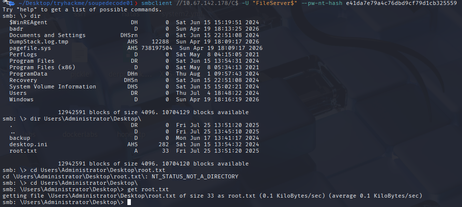

---
