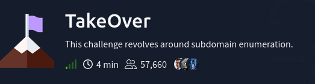
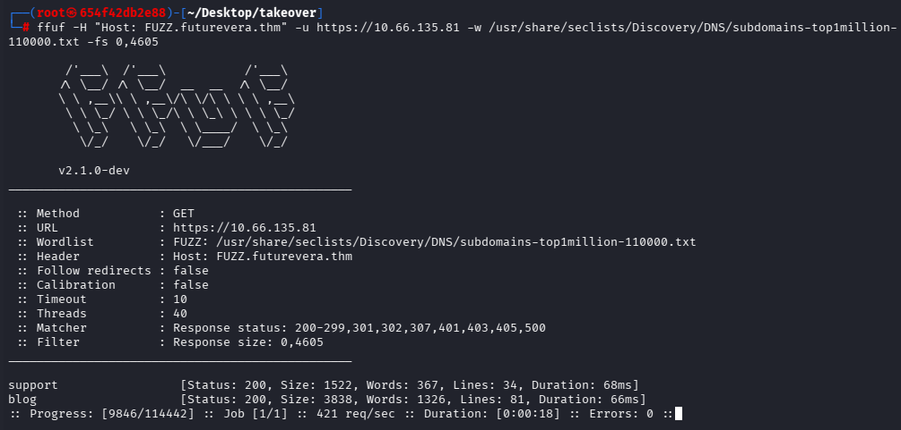
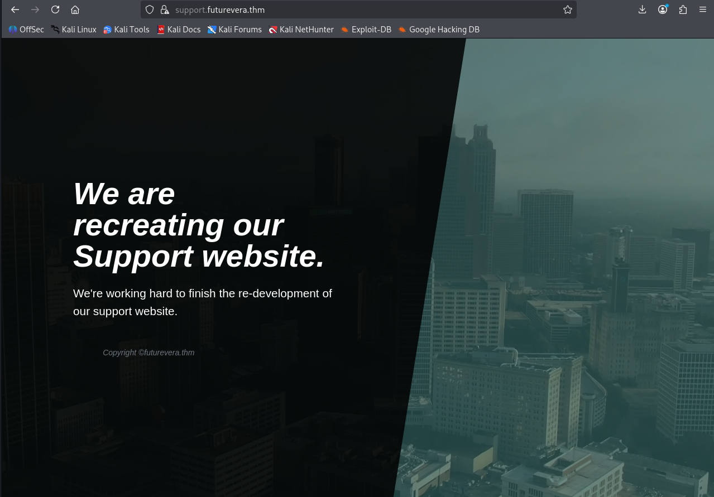
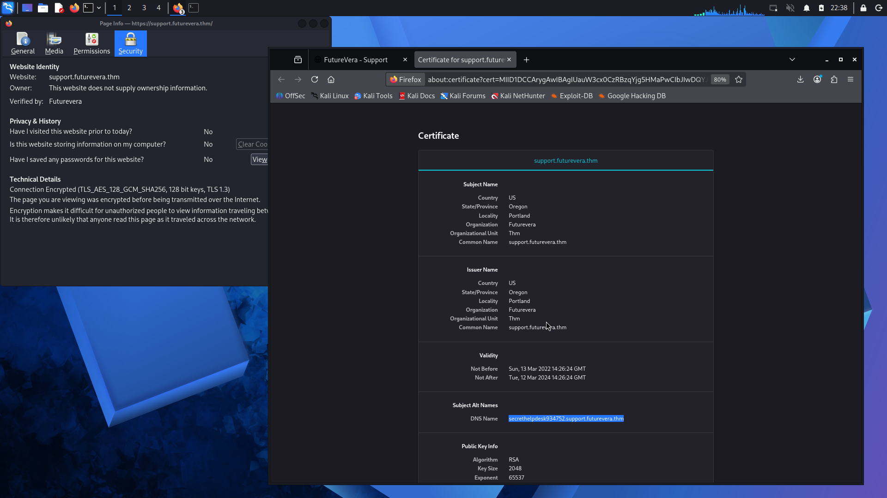
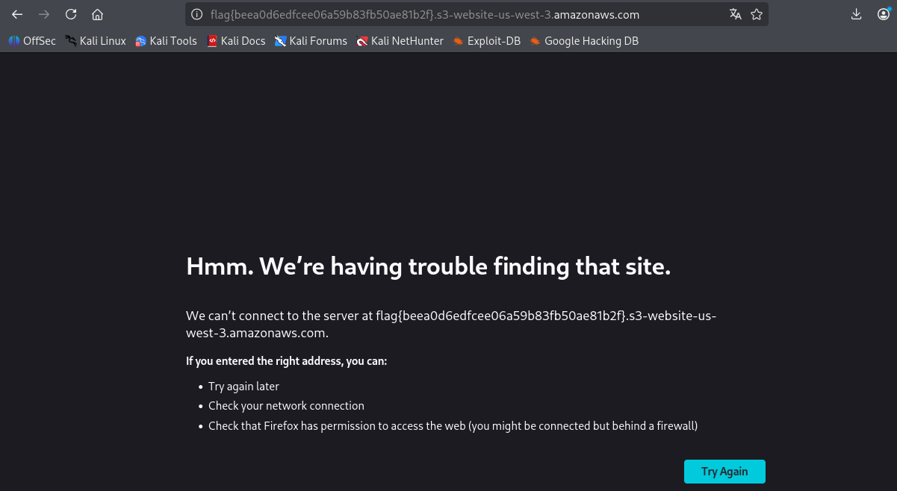

# Reto: TakeOver
- Dificultad: Facil
- Tipo: Desafio
- Tecnologia: Navegador web

---

El desafio consiste en una especie de auditoria, una empresa necesita que les mostremos el "punto vulnerable".

Accediendo a la pagina principal se puede ver una web simple.

Usando fuzzing se lograron descubrir algunos dominios (dejando en claro la ip de el sevridor).

El subdominio **support** alberga una web simple.
Lo interesante de este subdominio es el certificado. La web usa https, pero el certificado no es optimo.

Viendo el certificado se pudo encontrar un nuevo dominio.
Al intentar acceder a este se pudo ver una pagina de error, la cual contiene la flag.

