# Maquina: Pickle Rick
- Dificultad: Facil
- OS: Linux

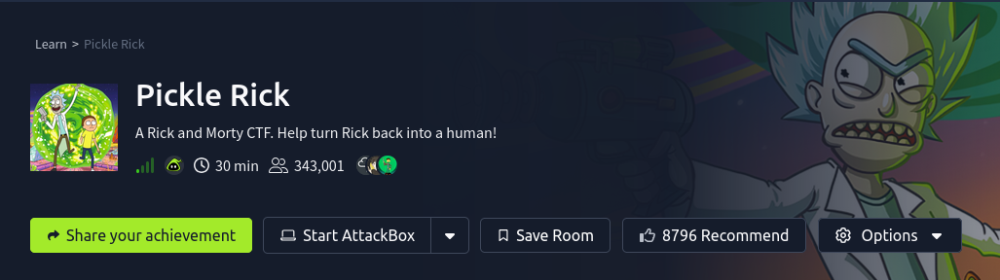

## Resolucion

La etapa de reconocimiento inicia con un escaneo de nmap, descubriendo el puerto 80, el cual alberga un servicio web.

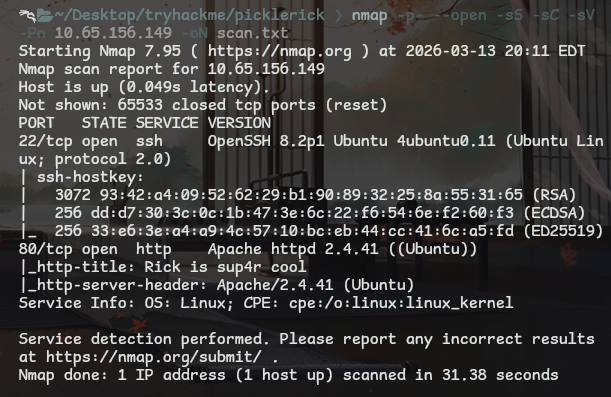

Usando gobuster para un escaneo se pueden pbservar varias rutas interesantes.
Viendo tanto directorios como archivos de interes.

```
gobuster dir -u http://<IP> -w /usr/share/wordlists/dirbuster/directory-list-1.0.txt -x html,php,xml,js,yml,txt -o dir_scan.txt
```

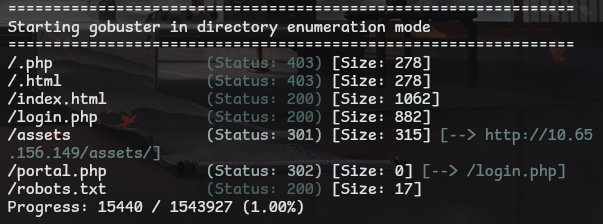

Viendo la web desde el navegador se puede ver una pagina interesante.
Una llamada de auxilio de rick, en donde pide unos ingredientes para una pocion (las vanderas).

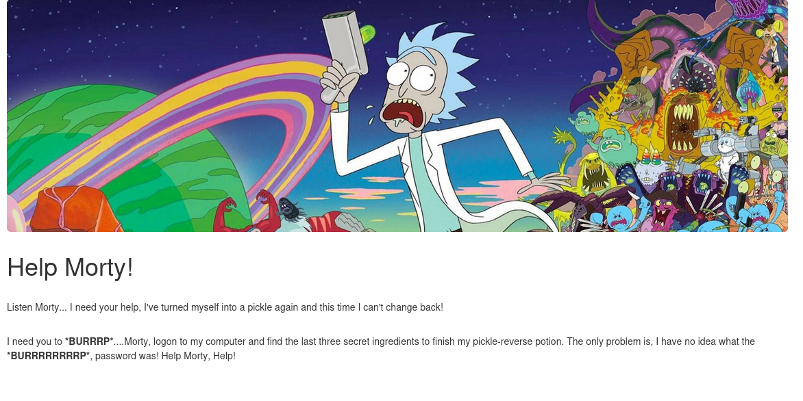

Viendo el codigo de la web principal se puede ver un posible usuario para un acceso.
Y accediendo al archivo **robots.txt** se puede ver una posible clave.

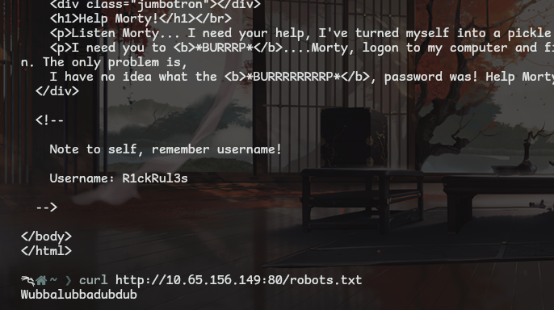

Despues de acceder a la web desde el login con estos datos se puede ver una pagina que permite ejecutar codigo, usando **ls** se pueden ver algunos archivos.

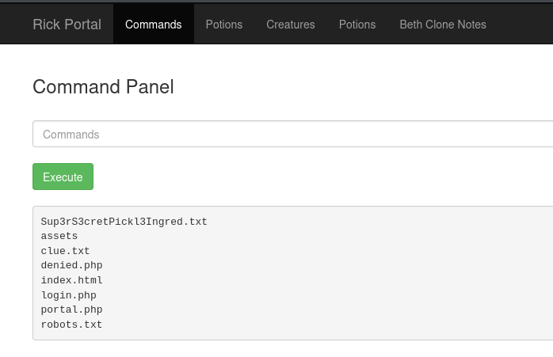

Algo interesante es que las demas opciones de la pagina muestran el mismo mensaje.
Viendo al pepinillo rick en su entrada.

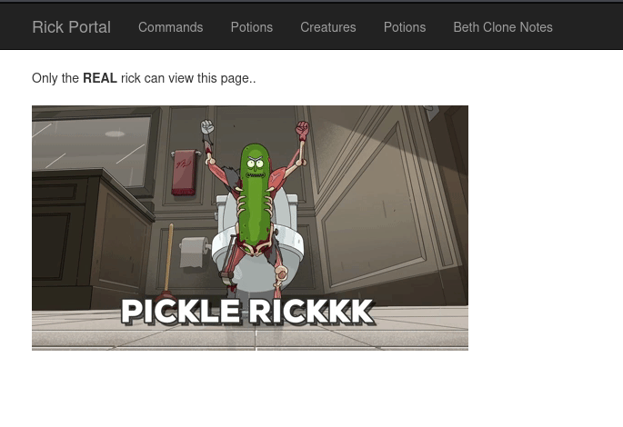

Volviendo a la informacion encontrada se pudo acceder a los archivos **clue.txt** y **Sup3rS3cretPickl3Ingred.txt** usando curl desde la terminal.
Logrando ver un ingrediente (el cabello de mr messek) y una pista, la cual indica que revisemos los archivos de el sistema.

> Flag 1:
> mr. meeseek hair

---

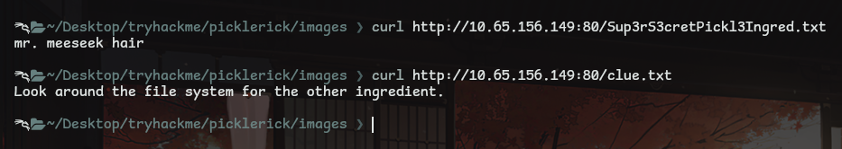

Explorando los archivos de el sistema se puede ver que hay un archivo muy obvio dentro de el directorio **/home/rick**.
Dentro de el directorio se puede encontrar el archivo **Second Ingredients**, el cual contiene la informacion.
La web obviamente no permite que se pueda usar el comando cat, asi que se uso el comando **less**.

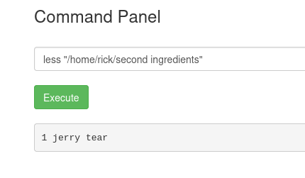

> Flag 2:
> jerry tear

---

Desde el input que ya tenemos se uso el comando **sudo -l** para descubrir alguna via de explotacion.
Viendo que no hay restricciones respecto al usuario sudo.

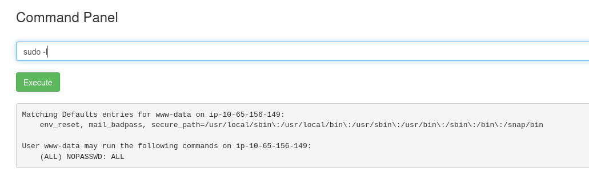

Listando los archivos de el directorio **/root**, en donde aparece el ultimo archivo requerido.

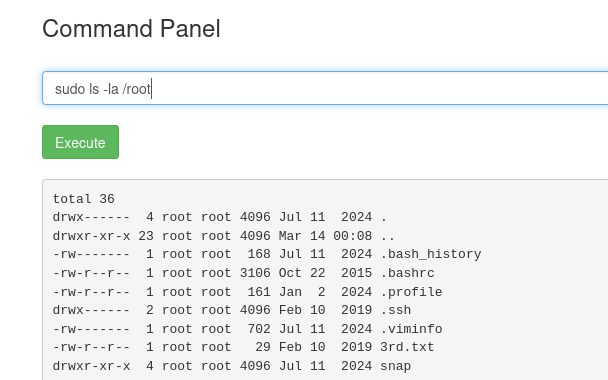

> Flag 3:
> fleeb juice

---

## Conclusion

Una maquina muy interesante, la considero de nivel facil, sigue la estructura de analisis de un ctf clasico.
La tematica de rick y morty me encanto, aunque tampoco satura con informacion, lo cual agradezco para no volver tedioso el reto.
