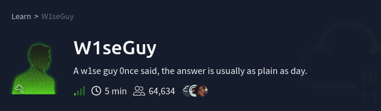
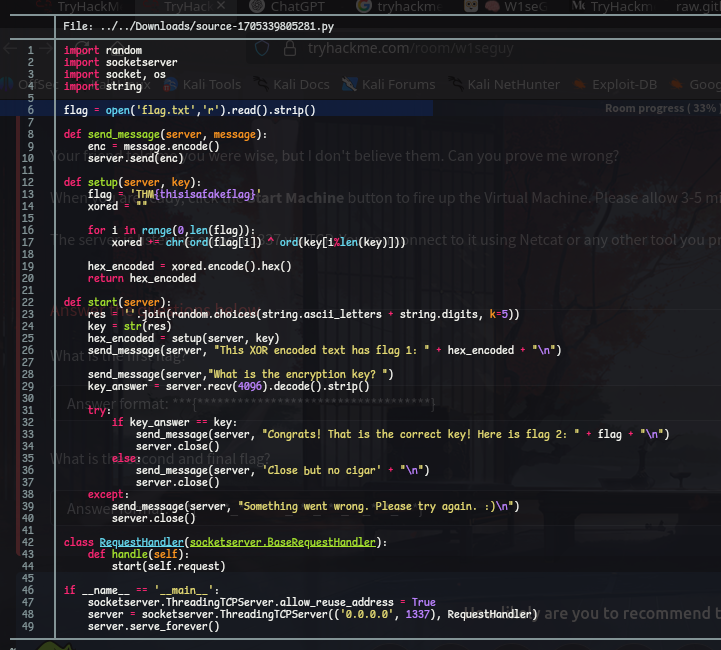
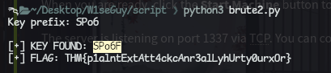
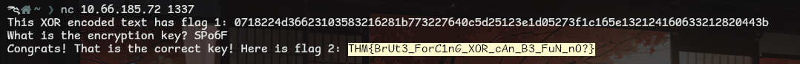

# Reto: W1seGuy
- Dificultad: Facil
- Tecnologia: Netcat



---

El reto presenta un archivo python a descargar, este:

- Genera una clave aleatoria de 5 caracteres
- Hace XOR entre la flag y la clave
- Convierte el resultado a hex
- Envía el texto cifrado al cliente.



---

pora iniciar con el reto hay que conectarse por netcat, logrando ver un codigo y una pregunta.

``` bash
nc <IP> 1337
```

Para resolver esto se creo un script que resuelve el asunto de el codigo.

``` python
import binascii
import string

encrypted_hex = ""

encrypted = binascii.unhexlify(encrypted_hex)

known_plain = "THM{"

# recuperar prefix key
key_prefix = ""
for i in range(len(known_plain)):
    key_prefix += chr(encrypted[i] ^ ord(known_plain[i]))

print("Key prefix:", key_prefix)

charset = string.ascii_letters + string.digits + string.punctuation

for c in charset:
    key = key_prefix + c

    decrypted = ""
    for i in range(len(encrypted)):
        decrypted += chr(encrypted[i] ^ ord(key[i % len(key)]))

    # filtros para encontrar la flag correcta
    if decrypted.startswith("THM{") and decrypted.endswith("}"):
        print("\n[+] KEY FOUND:", key)
        print("[+] FLAG:", decrypted)
        break
```



Las banderas de tryhackme casi siempre inician con **THM{**, asi que ya hay 4 de 5 caracteres.
Haciendo fuerza bruta se puede obtener la llave y la primera bandera, pudiendo ya con estas responder a la pregunta que se nos hizo y obtener la segunda bandera.



